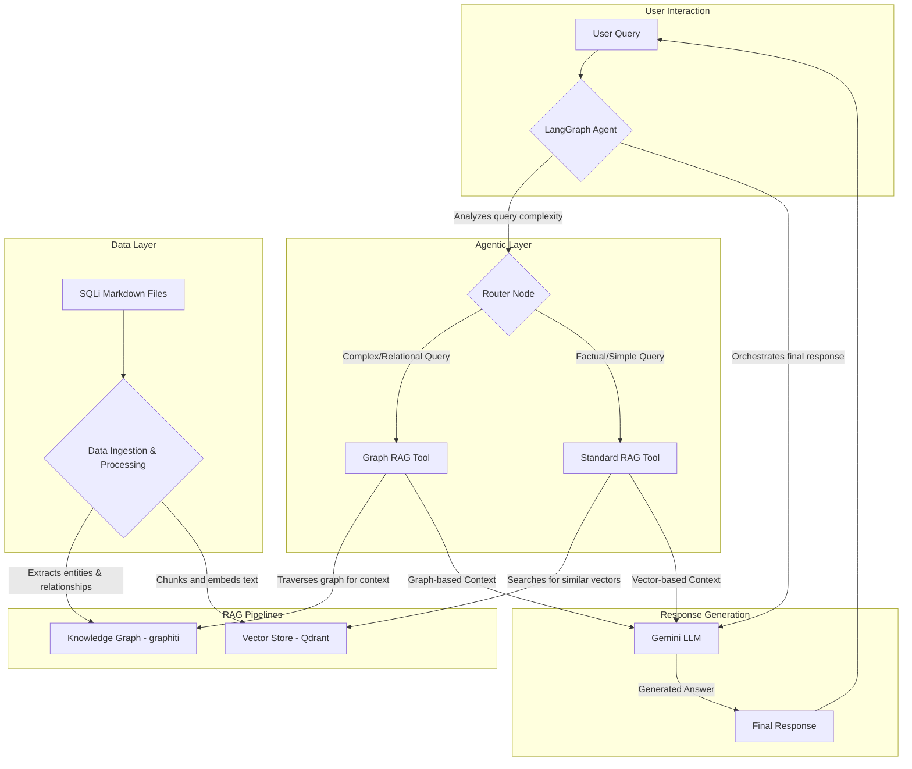

# AI Penetration Testing Assistant: Project Plan

This document outlines the architecture and development plan for an AI agent designed to assist penetration testers with payload research and technique discovery.

## 1. Project Overview

The goal is to create a sophisticated AI agent that leverages a combination of standard and graph-based Retrieval-Augmented Generation (RAG) to provide expert-level guidance on SQL injection techniques. The agent will be built using Python, LangGraph, and FastAPI, with Qdrant for vector storage and `graphiti` for the knowledge graph.

## 2. System Architecture

The architecture is designed to be modular and scalable. A LangGraph agent will act as the central orchestrator, dynamically choosing between a standard RAG tool and a Graph RAG tool based on the user's query.

## 3. Component Breakdown

### 3.1. Data Ingestion and Processing
This initial stage is crucial for both RAG pipelines.
-   **Source**: Markdown files from the `PayloadsAllTheThings/SQL Injection` directory.
-   **Vector Pipeline**:
    -   The markdown files will be parsed and chunked into meaningful segments.
    -   Each chunk will be embedded using the `GEMINI_EMBEDDING_MODEL`.
    -   The resulting vectors will be stored in the Qdrant collection specified in the `.env` file.
-   **Graph Pipeline**:
    -   We will use the Gemini model to extract entities (e.g., `technique`, `database`, `payload`, `function`) and relationships (e.g., `APPLIES_TO`, `USES_PAYLOAD`, `IS_TYPE_OF`) from the text.
    -   These entities and relationships will be used to construct a knowledge graph using `graphiti`. This allows for incremental updates without re-processing the entire dataset.

### 3.2. Standard RAG Tool (Qdrant)
This tool will handle straightforward queries that can be answered by finding similar text passages.
-   **Function**: Takes a user query, embeds it, and performs a similarity search in the Qdrant collection.
-   **Output**: Returns the most relevant text chunks as context.

### 3.3. Graph RAG Tool (graphiti)
This tool is for complex queries that require understanding relationships between different concepts.
-   **Function**: Takes a user query, identifies key entities, and traverses the knowledge graph to find interconnected information. For example, finding all `RCE` techniques for `MySQL`.
-   **Output**: Returns a structured context derived from the graph traversal.

### 3.4. LangGraph Agent
This is the core of the application, orchestrating the entire process.
-   **State Machine**: It will manage the flow of information through the graph.
-   **Router**: A conditional node will analyze the user's query to decide which RAG tool (or combination of tools) is best suited to answer it. Simple questions might go to the standard RAG, while complex ones ("how-to", "what's the next step") will leverage the Graph RAG.
-   **LLM Integration**: It will pass the retrieved context and the original query to the Gemini model to generate a coherent, human-readable answer.

### 3.5. API Server (FastAPI)
A simple web server will be created to expose the agent's functionality via a REST API.
-   **Endpoint**: A single endpoint (e.g., `/ask`) will accept user queries.
-   **Deployment**: The API will be served using Uvicorn, as configured in the `.env.example` file.

## 4. Technology Stack

-   **Orchestration**: LangChain, LangGraph
-   **Language Model**: Google Gemini (via `langchain-google-genai`)
-   **Vector Store**: Qdrant (`qdrant-client`)
-   **Graph Database**: `graphiti`
-   **Web Framework**: FastAPI
-   **Server**: Uvicorn

## 5. Next Steps

With the plan established, the next phase is implementation. We will proceed according to the to-do list, starting with setting up the project environment.