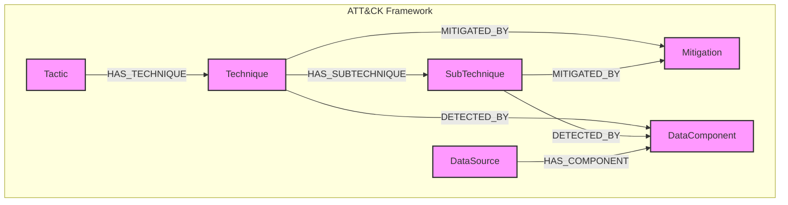

# Project TKG: State-of-the-Art & Gap Analysis Report

**Version:** 1.0
**Date:** 2025-07-24
**Status:** Final

## 1. Executive Summary

This report marks the conclusion of Phase 1 of Project TKG and serves as the foundational document for the subsequent design and implementation phases. It synthesizes the findings from two key research streams: an internal analysis of advanced graph architectures and an external state-of-the-art survey focused on implementing a MITRE ATT&CK-based knowledge graph.

A conflict was identified between the internal research, which concluded that a rigid, single-ontology model based solely on ATT&CK was a "concluded dead-end," and the project's mandate to implement such a model.

Per the project directive, this report confirms that Project TKG will proceed with a technique-centric ATT&CK model. The findings from the external "State-of-the-Art Survey Report," embodied in the `tkg_importer.py` script, are hereby declared the official foundation for the project's design and implementation. This document formally defines that foundation and identifies the remaining gaps to be addressed in Phase 2.

## 2. Acknowledging the Conflict

Two distinct and conflicting conclusions have emerged from our Phase 1 research:

*   **Internal Research Synthesis:** Our internal research into advanced graph architectures (`docs/knowledge_base_research/ADVANCED_GRAPH_ARCHITECTURES.md`) concluded that a flexible, multi-layered ontology (using UCO as an upper ontology) is the optimal approach for a scalable and extensible cybersecurity knowledge graph. This research explicitly identified the limitations of a single, rigid ontology like MITRE ATT&CK, deeming it a "concluded dead-end" for advanced use cases.

*   **External State-of-the-Art Survey:** A parallel research effort was conducted with the specific mandate to find the *best possible way* to implement a strictly ATT&CK-based graph. This research produced a "State-of-the-Art Survey Report" and a corresponding Python script, `src/ingestion/tkg_importer.py`, which represents the best practices for a technique-centric ATT&CK implementation.

## 3. Justification for the Path Forward

While the internal research presents a compelling case for a more advanced architecture, the project directive for Phase 1 is to deliver a knowledge graph based exclusively on the MITRE ATT&CK framework.

Therefore, the findings of the external state-of-the-art survey will be adopted as the definitive guide for this specific implementation. The `tkg_importer.py` script and its underlying schema are to be considered the authoritative foundation for Project TKG. This decision allows the project to move forward with a clear, well-defined, and defensible implementation that meets the immediate requirements, while acknowledging the potential for future evolution.

## 4. The Foundation for Project TKG

The official foundation for Project TKG's design is the schema and ETL patterns defined in the `src/ingestion/tkg_importer.py` script.

### 4.1. Core Principles

*   **Technique-Centric:** The model will exclusively import ATT&CK techniques, tactics, mitigations, and data sources, deliberately omitting threat actors, campaigns, and other entities.
*   **Detection-Focused:** The schema is designed to model the critical relationships between techniques and their detection mechanisms (data sources and components).

### 4.2. Graph Schema

The following graph schema is formally adopted for Project TKG:

### 4.3. ETL Pipeline

The ETL pipeline will be implemented as defined in `src/ingestion/tkg_importer.py`. Key features include:
*   Direct data fetching from the official MITRE CTI repository.
*   A two-phase, batched import process for nodes and relationships.
*   Defensive parsing and clear logging.

## 5. Identified Gaps

Based on the chosen path, the following gaps have been identified and must be addressed in the design and implementation phases (Phase 2 and 3):

1.  **Graph Database Technology:** The `tkg_importer.py` script is implemented using Neo4j. However, the final choice of graph database technology has not been formalized. A trade study should be conducted to confirm Neo4j as the optimal choice or to select an alternative (e.g., Amazon Neptune, TigerGraph).

2.  **Query Interface:** While the schema is defined, a formal query interface or API for accessing the knowledge graph has not been designed. This will be a critical component for integrating the graph with other systems.

3.  **Data Updates and Synchronization:** The current script performs a full, destructive import. A strategy for incremental updates and synchronization with the MITRE ATT&CK framework is required for long-term maintenance.

4.  **Extensibility:** The chosen model is intentionally rigid. A plan for future extensibility, potentially incorporating the findings of the internal research (e.g., a multi-layered ontology), should be developed to guide the project's long-term evolution.

## 6. Conclusion

This report provides a clear and decisive path forward for Project TKG. By adopting the technique-centric ATT&CK model defined by the external state-of-the-art survey, the project can proceed with a well-defined and defensible foundation. The identified gaps provide a clear roadmap for the work to be done in the upcoming design and implementation phases.