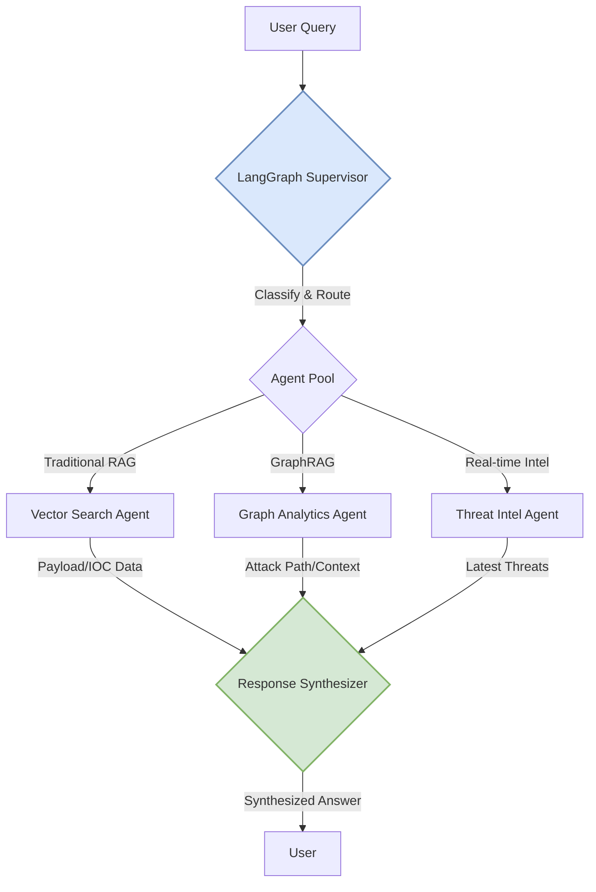
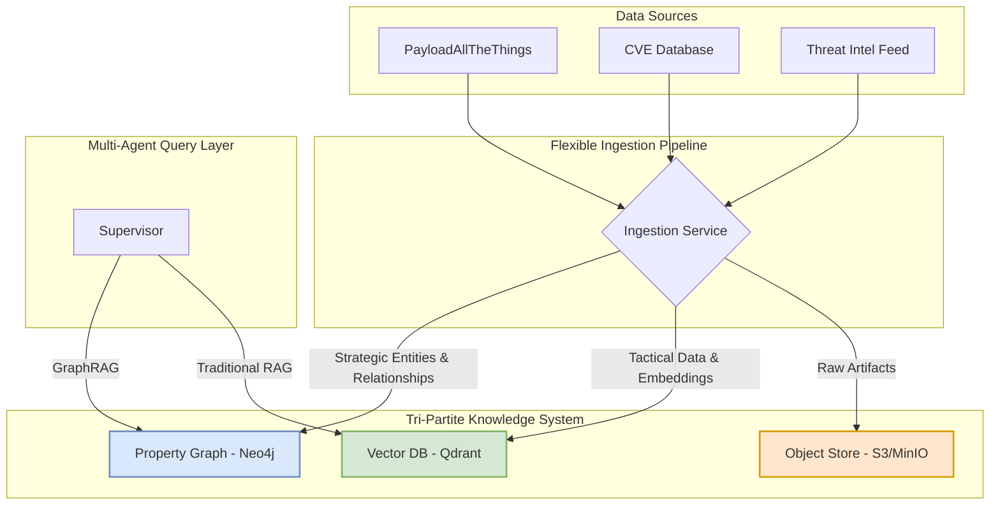
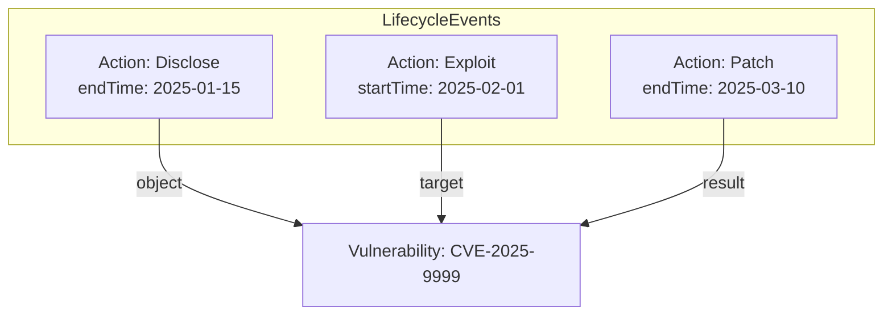
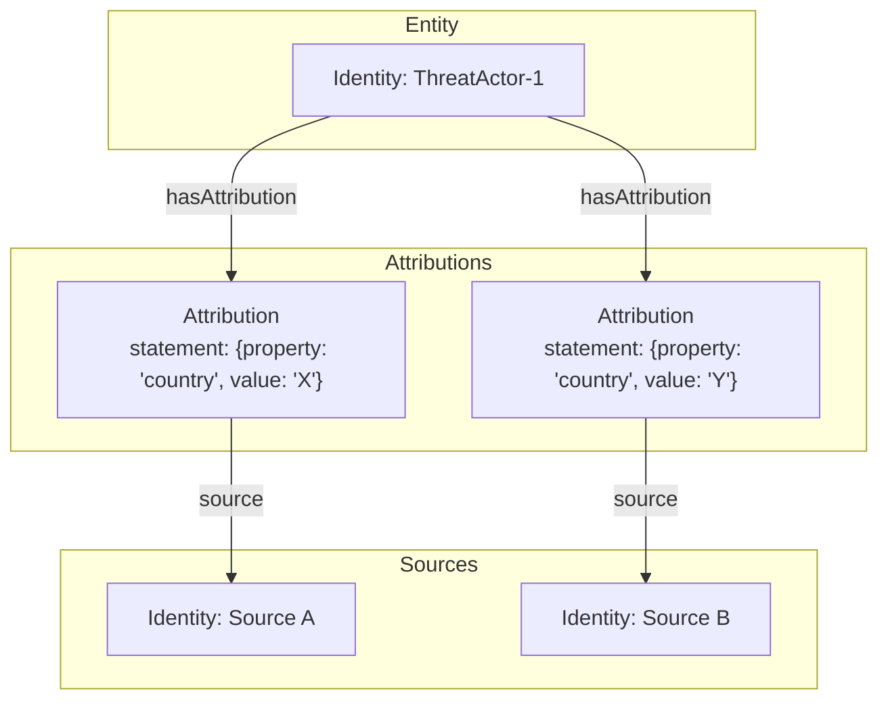
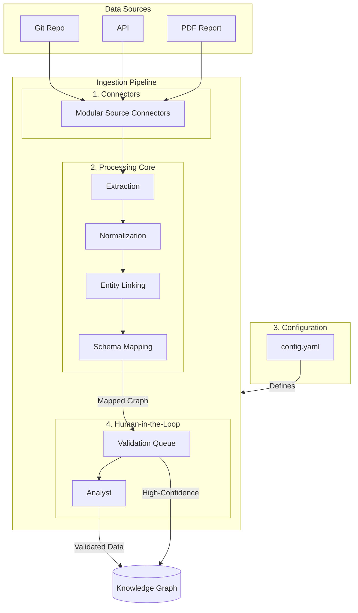

# AlgoBrain: The Complete System Blueprint
# A Unified Knowledge Graph Architecture for Next-Generation Cybersecurity Intelligence

## 1. Introduction & Vision

### 1.1. Executive Summary

This document presents the final, synthesized proposal for a next-generation cybersecurity knowledge base. It represents the culmination of exhaustive research into advanced graph architectures, data modeling, and ingestion pipelines. The proposed architecture moves decisively away from a rigid, single-ontology model towards a flexible, extensible, and powerful intelligence system designed to serve as the brain for a predictive security agent.

The core of this proposal is a **Unified Knowledge Graph** built on three foundational principles: a **Multi-Layered Ontology**, **Event-Centric Modeling**, and **Assertion-Based Evidence**. This architecture allows us to unify diverse, heterogeneous data sources—from structured vulnerability feeds and unstructured threat reports to raw exploit code—into a single, coherent, and queryable system.

By explicitly modeling causality, uncertainty, and the provenance of all information, this new architecture provides a robust foundation for advanced reasoning. It is designed not just to store what is known, but to enable the discovery of unknown patterns, the prediction of emerging threats, and the automated generation of actionable intelligence. This blueprint outlines the complete end-to-end vision, from the unified schema and ingestion pipeline to the advanced capabilities this system will unlock.

### 1.2. High-Level Goals

*   **Create a Single Source of Truth:** Consolidate all cybersecurity knowledge into one unified, queryable system.
*   **Enable Advanced Reasoning:** Move beyond simple data retrieval to support complex queries, pattern detection, and predictive analysis.
*   **Automate Intelligence Generation:** Build the foundation for an agentic system that can autonomously generate actionable insights for red-team operations.
*   **Ensure Data Quality & Trust:** Implement robust mechanisms for tracking data provenance, confidence, and handling conflicting information.

---

## 2. System Architecture

The AlgoBrain system is a sophisticated multi-agent RAG (Retrieval-Augmented Generation) platform orchestrated by a central supervisor agent. This architecture is designed for complex, multi-step reasoning tasks that require the coordination of diverse, specialized AI agents. It intelligently analyzes incoming queries, decomposes them into sub-tasks, and routes them to the appropriate agents that interact with a tri-partite data backend. This approach allows the system to combine the speed and semantic power of traditional vector search with the deep, contextual reasoning of graph-based analysis.

### 2.1. LangGraph Supervisor Architecture

The system's core is a supervisor agent built with LangGraph. This supervisor acts as the "brain" of the operation, managing the flow of information and tasks between all other components. It is responsible for maintaining the state of the entire system, making decisions about which tools or agents to use, and synthesizing the final response from the outputs of the various agents. This pattern is crucial for handling complex queries that cannot be answered by a single tool or data source.



#### 2.1.1. State Management

A `TypedDict` is used for robust state management, ensuring type safety and clear data flow between agents.

```python
from typing import TypedDict, Annotated, Sequence, Optional, List, Dict
from langchain_core.messages import BaseMessage
from langgraph.graph import add_messages

class RedTeamAgentState(TypedDict):
    # Core communication
    messages: Annotated[Sequence[BaseMessage], add_messages]
    query: str
    
    # Agent orchestration
    agent_outcome: Optional[str]
    agent_path: List[str]
    
    # Red-team specific context
    attack_context: Dict
    target_environment: Dict
    engagement_metadata: Dict
    
    # Performance tracking
    processing_time: float
    confidence_scores: Dict[str, float]
```

#### 2.1.2. Conditional Routing

The supervisor uses a classification function to analyze the user's query and route it to the appropriate agent or combination of agents. This allows for efficient, parallel processing of complex queries.

```python
def classify_red_team_query(query: str) -> Dict:
    # ... logic to classify query into PAYLOAD, CHAIN, INTEL, TOOL ...
    # Returns a dictionary with primary_type, confidence, and requires_multi_agent
    pass

async def multi_agent_processing(state: RedTeamAgentState) -> Dict:
    classification = classify_red_team_query(state["query"])
    
    tasks = []
    if classification.get("has_payload_component"):
        tasks.append(traditional_rag_agent.aprocess(state))
    if classification.get("has_relationship_component"):
        tasks.append(graph_rag_agent.aprocess(state))
    
    results = await asyncio.gather(*tasks)
    return await synthesize_results(results, state)
```

### 2.2. The Tri-Partite Data Architecture

To support the flexible ontology model and efficiently handle a mix of structured, semi-structured, and unstructured data, a tri-partite data architecture is employed. This model separates data based on its structure and access patterns, allowing us to use the most efficient storage and retrieval engine for each data type.

1.  **Property Graph (Neo4j):** This is the system's source of truth for all structured entities and their complex relationships. It is optimized for deep, multi-hop queries, making it ideal for strategic reasoning, attack path analysis, and understanding the intricate connections between threats, vulnerabilities, and assets.
2.  **Vector Database (Qdrant):** This is the primary repository for tactical data that requires fast semantic search. It stores high-dimensional vector embeddings of content like exploit code, IOCs, and technique descriptions, enabling the system to quickly find semantically similar items.
3.  **Object Store (MinIO/S3):** This component serves as a durable, scalable repository for all raw, unstructured artifacts, such as PDF reports, binaries, or pcap files. The knowledge graph and vector database do not store these large files directly; instead, they hold pointers (URIs) to the artifacts in the object store, ensuring the primary databases remain lean and performant.



---

## 3. Knowledge Graph Core

### 3.1. Core Architectural Principles

The unified knowledge graph is founded on three core principles that work in concert to create a flexible, scalable, and powerful system capable of representing the complex, often ambiguous nature of cybersecurity intelligence.

1.  **Multi-Layered Ontology:** This principle addresses the challenge of schema rigidity. Instead of a single, monolithic schema, we divide our model into two layers. The **Upper Ontology** (UCO) is a stable, abstract layer defining universal concepts like `Action`, `Object`, and `Identity`. This provides a consistent framework for querying across the entire graph. The **Domain Ontologies** are flexible, specialized schemas that provide rich detail for specific data types, such as a `Payload` ontology for exploit code or a `Vulnerability` ontology for CVEs. This allows us to rapidly add new data sources with their own detailed models without needing to perform a disruptive migration of the core schema.
2.  **Event-Centric Modeling:** To capture causality and narrative, we model actions as first-class citizens. Instead of a simple, direct link like `(ThreatActor) -[:USES]-> (Malware)`, we model the action itself: `(ThreatActor) -[:PERFORMED]-> (MalwareDeploymentEvent) -[:USED_TOOL]-> (Malware)`. This `uco-action:Action` node preserves the full context of an event, including the time, location, and other participants. This approach is critical for accurately reconstructing attack chains and understanding the sequence of events in an intrusion.
3.  **Assertion-Based Evidence:** Recognizing that intelligence is often uncertain or conflicting, we treat all information as an assertion from a specific source, not as an absolute fact. Every piece of data is encapsulated in a `uco-core:Attribution` node, which links the information to its `Source` (e.g., a specific threat report) and the `Action` or `Object` it describes. This `Attribution` node can hold metadata like confidence scores, analyst notes, and timestamps, making the entire knowledge graph auditable and allowing the system to reason about conflicting reports.

### 3.2. The Unified Schema: Adopting UCO

We have formally adopted the **Unified Cyber Ontology (UCO)** as the Upper Ontology. This provides critical advantages in interoperability, robustness, and alignment with our core principles.

| Initial Concept | UCO Equivalent | Implementation Notes |
| :--- | :--- | :--- |
| `Entity` | `uco-core:UcoObject` | Concrete instances will use specific subclasses (e.g., `uco-identity:Identity`, `uco-tool:Tool`). |
| `Event` | `uco-action:Action` | A direct mapping. Relationships map to UCO roles like `performer` and `instrument`. |
| `Source` | `uco-identity:Identity` | The origin of data is modeled as an `Identity` object. |
| `Assertion` | `uco-core:Attribution` | Implemented via the `Attribution` object, linking an `Action` to its `Source`. |

### 3.3. Advanced Modeling Patterns

#### 3.3.1. Vulnerability Lifecycle

The state of a vulnerability is derived from an immutable sequence of `Action` nodes (`Disclose`, `Exploit`, `Patch`) that target the central `Vulnerability` node. This provides a fully auditable temporal model.



#### 3.3.2. Handling Conflicting Evidence

To handle conflicting intelligence, we use the **"Attributed Statement"** pattern. The core entity node remains "clean," and each piece of sourced information is stored in a separate `Attribution` node.



---

## 4. Data Ingestion & Processing

The ingestion pipeline is a modular, configuration-driven system designed to populate the unified schema from diverse, heterogeneous sources. It is architected to be flexible and extensible, allowing new data sources and processing techniques to be added with minimal code changes. The entire process is underpinned by a robust Human-in-the-Loop (HITL) system to ensure the highest standards of data quality and accuracy.

### 4.1. Ingestion Pipeline Architecture



### 4.2. Human-in-the-Loop (HITL) System

A critical component for ensuring data quality, the HITL system is designed to leverage human expertise to validate, correct, and enrich the data generated by the automated pipeline. All AI-generated assertions with a confidence score below a configurable threshold are routed to a validation queue for manual review by a security analyst.

*   **UI:** The system features a dedicated two-panel web interface designed for high-throughput analysis. Analysts can quickly view the source document with evidence highlighted, edit the structured assertion, and approve or reject the data. The UI includes features like entity autocomplete and keyboard shortcuts to maximize efficiency.
*   **Prioritization:** A message-driven queue (e.g., RabbitMQ or Kafka) is used to manage the flow of assertions to the HITL system. This decouples the ingestion pipeline from the validation process and allows for scalable, asynchronous processing.
*   **Feedback Loop:** The corrections and validations made by analysts are not just used to fix individual data points; they are collected into a "golden dataset." This dataset is then used in a scheduled job to fine-tune the AI models used in the extraction and entity linking stages, creating a continuous improvement loop where the system gets smarter over time.
*   **Gamification:** To encourage engagement and maintain high standards, the HITL system includes gamification elements. A leaderboard tracks analyst performance based on a combination of throughput and accuracy, and digital badges are awarded for achieving specific milestones.

---

## 5. Technology Stack & Implementation

This section details the specific technologies chosen for each component of the AlgoBrain architecture, along with the rationale and implementation strategy.

### 5.1. GraphRAG: Graphiti + Neo4j

This component is the heart of the system's strategic reasoning capabilities.

*   **Graph Database:** Neo4j version 5.22.0 is used as the underlying graph database. It is configured with the APOC (Awesome Procedures on Cypher) library for extended functionality and has been performance-tuned with specific memory configurations and schema optimizations.
*   **GraphRAG Server:** The official Graphiti Docker image (`zepai/graphiti:latest`) is used to provide a high-level API for interacting with the knowledge graph. It is configured to use Gemini 2.5 Flash as its reasoning engine, which allows it to translate natural language questions into complex Cypher queries.
*   **Schema:** To ensure data integrity and optimize query performance, the Neo4j schema is strictly defined with unique constraints on key entity identifiers (e.g., `mitre_id`, `cve_id`) and performance indexes on frequently queried attributes like entity names.

### 5.2. Traditional RAG: Qdrant + SecureBERT

This component handles the high-speed semantic search required for tactical data retrieval.

*   **Vector Database:** Qdrant is used as the vector database. The architecture employs multiple, specialized collections, each tailored to a specific data type (e.g., `payloads`, `techniques`, `tools`, `intelligence`). This separation prevents semantic "bleed" between different data types and allows for more precise searches.
*   **Embedding Model:** SecureBERT, a RoBERTa-based transformer model that has been extensively fine-tuned on a 1-billion-token cybersecurity corpus, is used to generate vector embeddings. Its superior domain-specific accuracy (over 95% on NLP tasks) ensures that the semantic search is highly relevant to the penetration testing domain.
*   **Search Strategy:** The system uses a hybrid search approach that combines traditional keyword filtering with semantic vector search. A federated search function in the supervisor agent intelligently routes queries to the most relevant collections based on a classification of the user's intent.

### 5.3. MITRE ATT&CK Integration

The MITRE ATT&CK framework serves as the foundational ontology for the knowledge graph.

*   **Data Source:** The system directly ingests data from the official MITRE ATT&CK STIX 2.1 JSON repository, ensuring that the knowledge base is always aligned with the latest industry-standard framework.
*   **Pipeline:** A fully automated Python pipeline is responsible for fetching the latest STIX data on a schedule. It processes the STIX objects, transforms them into the graph schema, and ingests them into the Neo4j database, creating and updating `Technique`, `Tactic`, `Group`, and `Software` nodes and their relationships.

### 5.4. Deployment: Docker Compose

The entire system is designed for containerization and is orchestrated via a production-ready `docker-compose.yml` file. This approach ensures a consistent, reproducible deployment across different environments.

*   **Healthchecks:** Each service in the Docker Compose file includes a healthcheck. This is critical for controlling the startup order (e.g., ensuring the databases are healthy before the API starts) and for ensuring the overall resilience of the system.
*   **Volumes:** Named Docker volumes are used for all stateful services (Neo4j, Qdrant) to ensure that data is persisted across container restarts.
*   **Resource Limits:** The Docker Compose file defines specific CPU and memory reservations and limits for each service. This is essential for ensuring stable operation in a production environment and preventing any single service from consuming all available system resources.

---

## 6. Performance & Scalability

### 6.1. Response Time Targets

| Query Type | Target Time | Complex Queries | Multi-Agent |
| :--- | :--- | :--- | :--- |
| Simple payload lookup | < 500ms | < 1s | N/A |
| Attack chain analysis | < 2s | < 4s | < 5s |

### 6.2. Scalability & Caching

*   **Horizontal Scaling:** The API layer is stateless and can be scaled horizontally. Qdrant and Neo4j support clustered deployments.
*   **Caching:** An asynchronous Redis-based caching layer is implemented to cache frequent query results, reducing latency and database load.

---

## 7. Governance & Operations

*   **Ontology Working Group (OWG):** A dedicated team will govern the lifecycle of the Upper and Domain Ontologies through a formal, Git-based change proposal process.
*   **Federated Governance:** A model where the central team manages the core ontology, and domain teams are responsible for their specific extensions.
*   **Analyst Gamification:** A system of metrics, leaderboards, and badges to incentivize high-quality human-in-the-loop validation.

---

## 8. Roadmap

The development of AlgoBrain is structured into four distinct phases, moving from foundational setup to production-ready optimization.

### 8.1. Phase 1: Foundation Setup (Weeks 1-2)

**Objectives**: Establish core infrastructure and basic multi-agent architecture.

*   **Tasks**:
    *   **Infrastructure Setup**: Deploy Docker Compose with Neo4j, Qdrant, Graphiti, and other core services.
    *   **Core Agent Framework**: Implement the supervisor agent and a basic traditional RAG agent.
    *   **Security & Compliance**: Implement ethical usage guidelines and basic logging.
*   **Deliverables**: A working multi-agent system with existing SQLi knowledge, running on Docker.

### 8.2. Phase 2: Knowledge Graph Development (Weeks 3-5)

**Objectives**: Implement comprehensive GraphRAG with MITRE ATT&CK integration.

*   **Tasks**:
    *   **MITRE ATT&CK Integration**: Develop an ingestion pipeline for the MITRE framework and create the corresponding graph schema.
    *   **GraphRAG Agent Development**: Build out the Graphiti-based agent with attack chain analysis capabilities.
    *   **Knowledge Base Expansion**: Expand Qdrant collections and integrate SecureBERT embeddings.
*   **Deliverables**: A fully populated MITRE ATT&CK knowledge graph and a functional GraphRAG agent.

### 8.3. Phase 3: Advanced Features (Weeks 6-8)

**Objectives**: Implement specialized penetration testing features.

*   **Tasks**:
    *   **Threat Intelligence Integration**: Implement real-time web search and CVE database integration.
    *   **Advanced Agent Capabilities**: Develop contextual payload generation, a tool recommendation engine, and risk assessment features.
    *   **State Management**: Implement persistent conversation context and user preference learning.
*   **Deliverables**: A threat intelligence agent, a payload generation system, and a tool recommendation engine.

### 8.4. Phase 4: Production Optimization (Weeks 9-10)

**Objectives**: Optimize for production deployment and user experience.

*   **Tasks**:
    *   **Performance Optimization**: Implement caching strategies and optimize queries.
    *   **User Experience Enhancement**: Develop conversation management and feedback collection mechanisms.
    *   **Monitoring & Analytics**: Set up comprehensive logging, metrics, and performance dashboards.
*   **Deliverables**: A production-ready system with monitoring, optimized performance, and comprehensive documentation.

---

## 9. Appendices

This section provides detailed technical specifications for data models, database schemas, and API endpoints.

### 9.1. Data Models (Pydantic)

This defines the core data structures used throughout the application, ensuring type safety and clear data contracts.

```python
from pydantic import BaseModel, Field
from typing import List, Optional, Dict, Union, Literal
from datetime import datetime
from enum import Enum

class QueryType(str, Enum):
    PAYLOAD = "payload"
    TECHNIQUE = "technique"
    CHAIN = "chain"
    TOOL = "tool"
    INTEL = "intelligence"
    ANALYSIS = "analysis"

class AttackPhase(str, Enum):
    RECONNAISSANCE = "reconnaissance"
    INITIAL_ACCESS = "initial-access"
    EXECUTION = "execution"
    PERSISTENCE = "persistence"
    PRIVILEGE_ESCALATION = "privilege-escalation"
    DEFENSE_EVASION = "defense-evasion"
    CREDENTIAL_ACCESS = "credential-access"
    DISCOVERY = "discovery"
    LATERAL_MOVEMENT = "lateral-movement"
    COLLECTION = "collection"
    EXFILTRATION = "exfiltration"
    IMPACT = "impact"

class QueryClassification(BaseModel):
    primary_type: QueryType
    confidence: float = Field(ge=0.0, le=1.0)
    secondary_types: List[QueryType] = []
    requires_multi_agent: bool = False
    attack_phase: Optional[AttackPhase] = None

class TargetEnvironment(BaseModel):
    operating_systems: List[str] = []
    technologies: List[str] = []
    network_architecture: Optional[str] = None
    security_controls: List[str] = []
    privilege_level: Literal["user", "admin", "system", "unknown"] = "unknown"

class AttackContext(BaseModel):
    engagement_id: Optional[str] = None
    target_environment: TargetEnvironment
    current_phase: AttackPhase = AttackPhase.RECONNAISSANCE
    techniques_attempted: List[str] = []
    successful_techniques: List[str] = []
    discovered_vulnerabilities: List[str] = []
    acquired_credentials: List[Dict] = []
    pivot_points: List[str] = []
    objectives: List[str] = []

class RedTeamQuery(BaseModel):
    query: str
    context: AttackContext
    user_preferences: Dict[str, Union[str, bool, float]] = {}
    session_id: str
    timestamp: datetime = Field(default_factory=datetime.utcnow)

class RedTeamResponse(BaseModel):
    query_id: str
    classification: QueryClassification
    answer: str
    sources: List[Dict] # Simplified for brevity
    agent_responses: List[Dict] # Simplified for brevity
    updated_context: AttackContext
    next_steps: List[str] = []
    confidence_score: float = Field(ge=0.0, le=1.0)
    processing_time: float
    timestamp: datetime = Field(default_factory=datetime.utcnow)
```

### 9.2. Database Schemas

#### 9.2.1. Qdrant Collections

This defines the structure for the vector database collections, optimized for semantic search of tactical data.

```python
from qdrant_client.models import VectorParams, Distance

QDRANT_COLLECTIONS = {
    "payloads": {
        "vectors_config": VectorParams(size=768, distance=Distance.COSINE),
        "payload_schema": {
            "content": "text",
            "neo4j_node_id": "keyword",
            "payload_type": "keyword",
            "target_platforms": "keyword[]",
            "source": "keyword",
        }
    },
    "techniques": {
        "vectors_config": VectorParams(size=768, distance=Distance.COSINE),
        "payload_schema": {
            "content": "text",
            "neo4j_node_id": "keyword",
            "mitre_id": "keyword",
            "tactic": "keyword",
        }
    },
}
```

#### 9.2.2. Neo4j Graph Schema

This defines the constraints and indexes for the graph database, ensuring data integrity and query performance.

```cypher
-- Node Constraints
CREATE CONSTRAINT technique_mitre_id FOR (t:Technique) REQUIRE t.mitre_id IS UNIQUE;
CREATE CONSTRAINT tool_name FOR (to:Tool) REQUIRE to.name IS UNIQUE;
CREATE CONSTRAINT group_mitre_id FOR (g:Group) REQUIRE g.mitre_id IS UNIQUE;
CREATE CONSTRAINT vulnerability_cve FOR (v:Vulnerability) REQUIRE v.cve_id IS UNIQUE;

-- Performance Indexes
CREATE INDEX technique_name FOR (t:Technique) ON (t.name);
CREATE FULLTEXT INDEX technique_search FOR (t:Technique) ON EACH [t.name, t.description];

-- Example Relationship
(:Group)-[:USES {first_seen: datetime(), confidence: "high"}]->(:Technique)
```

### 9.3. API Endpoints

This defines the primary API endpoints for interacting with the AlgoBrain system.

#### 9.3.1. Core Query Endpoint

*   **Endpoint:** `POST /api/v1/query`
*   **Request Body:** `RedTeamQuery`
*   **Response Body:** `RedTeamResponse`
*   **Description:** The main endpoint for submitting intelligence queries. It accepts a query string and a detailed context object, and returns a synthesized answer along with provenance and updated context.

#### 9.3.2. WebSocket for Streaming Analysis

*   **Endpoint:** `WS /ws/analysis`
*   **Description:** A WebSocket endpoint for real-time, multi-step analysis tasks. The client can start an analysis and receive a stream of updates as the supervisor agent executes the plan.
