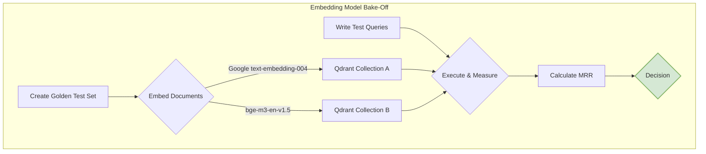

# Proposal: Upgrading the Embedding Model for AlgoBrain

## 1. Executive Summary

This document outlines the recommendation for upgrading the embedding model used in the AlgoBrain system, currently `SecureBERT`. The research indicates that modern, general-purpose models now outperform older, specialized models, even in their own domain. The decision hinges on a strategic choice between an API-first approach for performance and simplicity, or a self-hosted approach for data privacy and cost control.

The final recommendation is not to select a single model blindly, but to conduct a data-driven "bake-off" between the top two contenders to ensure the chosen model is demonstrably superior for AlgoBrain's specific mix of cybersecurity data.

## 2. The Two Primary Paths

The choice of the next embedding model is best framed as a decision between two architectural paths.

### Path A: API-First (Recommended for Simplicity & Performance)

*   **Top Candidate:** `Google text-embedding-004`
*   **Rationale:** This model offers state-of-the-art retrieval performance on general benchmarks. Its standout feature is **variable dimensionality**, allowing the embedding size to be adjusted (e.g., from 768 down to 256) without re-embedding the source documents. This provides unparalleled flexibility to tune the system's cost, performance, and accuracy trade-offs within the Qdrant vector database.

### Path B: Self-Hosted (Recommended for Data Privacy & Cost Control)

*   **Top Candidate:** `BAAI/bge-m3-en-v1.5`
*   **Rationale:** This is the top-performing open-source model that offers a practical balance of high retrieval accuracy and manageable resource requirements (1024 dimensions). For a cybersecurity application where data privacy is paramount, self-hosting is a critical advantage. This model was also explicitly designed to handle a mix of natural language and code, which directly aligns with AlgoBrain's data sources.

## 3. The Critical Gap: Domain-Specific Performance

A key finding is the absence of a standardized benchmark for cybersecurity-specific NLP tasks. General benchmarks like MTEB are excellent proxies, but they cannot fully capture the nuances of parsing CVEs, threat intelligence reports, and exploit code. Therefore, a direct comparison on AlgoBrain's own data is essential.

## 4. Recommended Action: The "Bake-Off"

To make a definitive, evidence-based decision, we propose a small-scale, head-to-head evaluation of the two leading models.

### Bake-Off Plan

1.  **Select Contenders:**
    *   `Google text-embedding-004` (API Path)
    *   `bge-m3-en-v1.5` (Self-Hosted Path)

2.  **Create a "Golden" Test Set:**
    *   Hand-pick ~100 documents from the corpus, representing a mix of CVEs, threat reports, and code snippets.
    *   For each document, write 3-5 realistic queries where that document is the correct answer.

3.  **Execute and Measure:**
    *   For each model, embed the 100 documents and store them in a separate Qdrant collection.
    *   Run all test queries against both collections.
    *   Calculate the **Mean Reciprocal Rank (MRR)** for each model. A higher MRR indicates better retrieval performance.

4.  **Decide:**
    *   Compare the MRR scores.
    *   If the scores are close, the final decision can be based on the strategic preference for either the operational ease of an API or the data control of a self-hosted solution.

This process will ensure that the chosen model is the best possible fit for AlgoBrain's unique requirements.

## 5. Next Steps

The next phase involves executing this bake-off. This will require a developer to implement the testing harness, run the evaluation, and report the results.