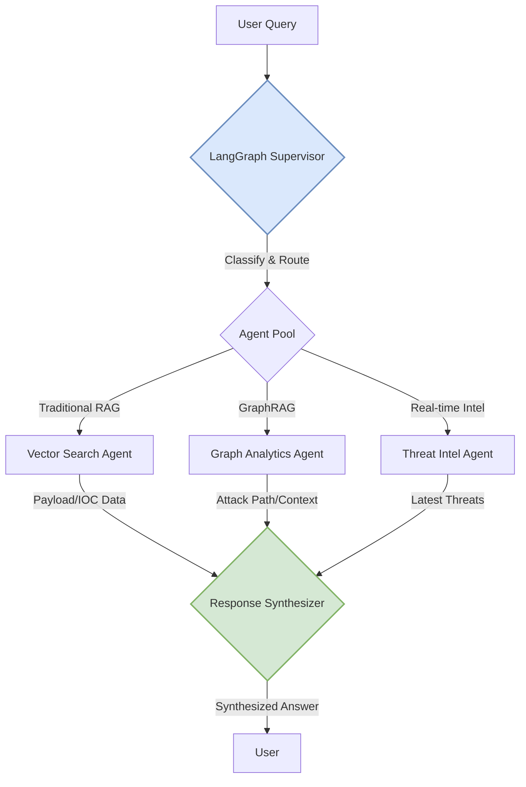
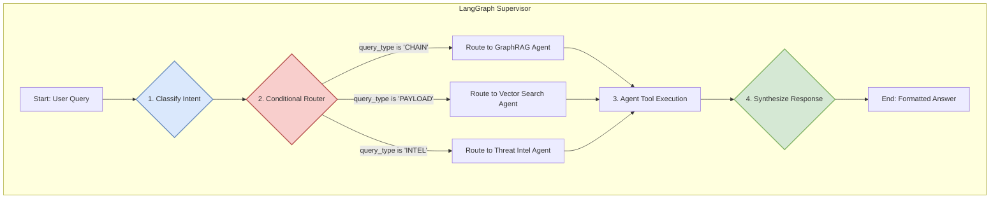
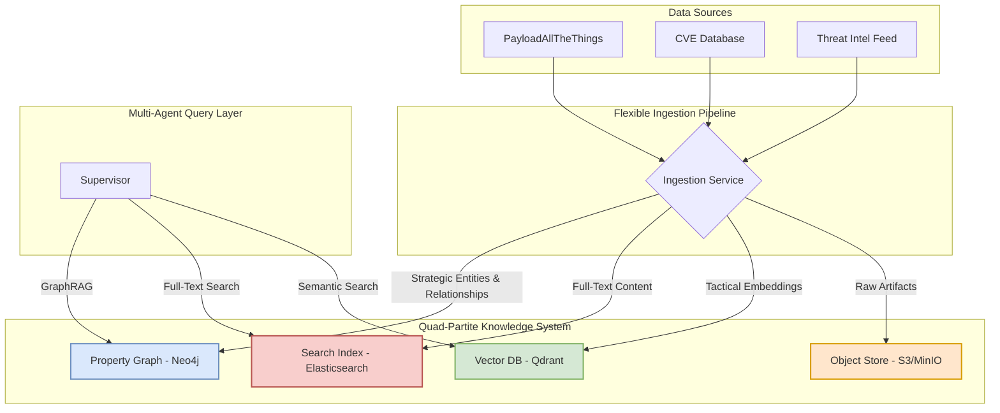
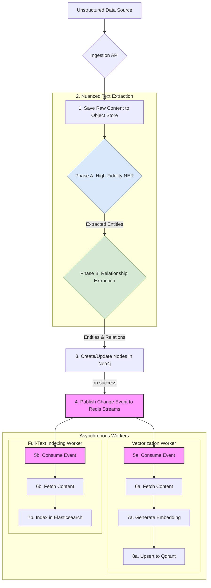
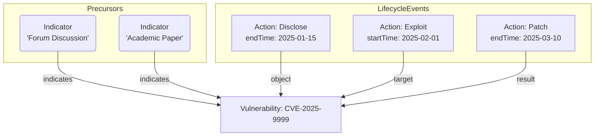
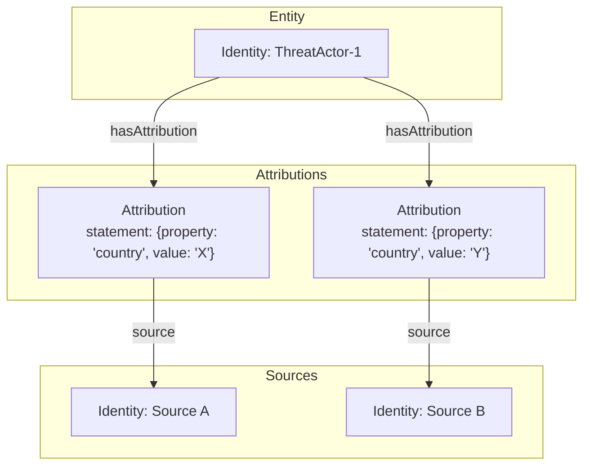
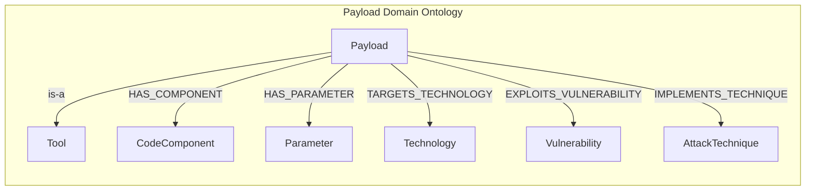
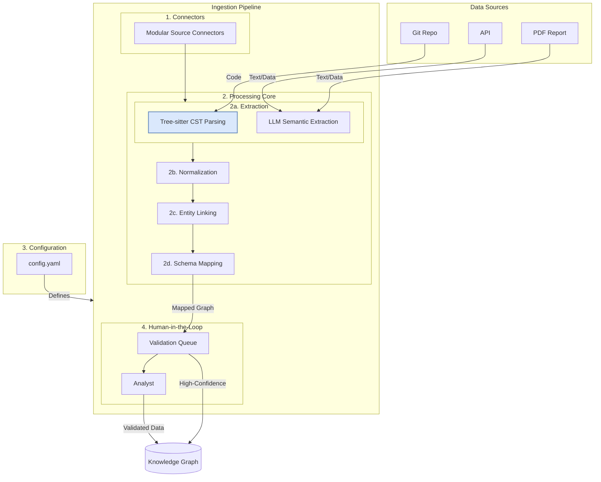
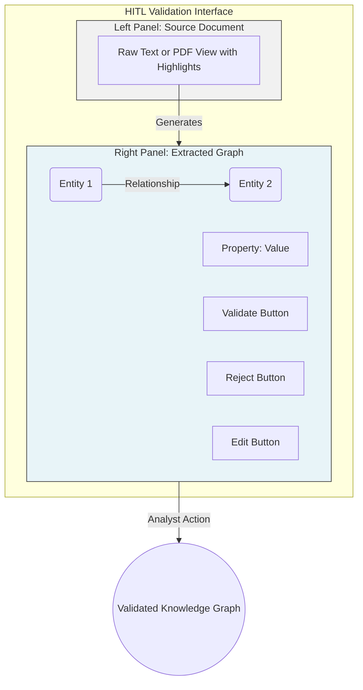

# Comparison of MITRE ATT&CK Datasets

This document summarizes the comparison between the `ics-attack-17.1.json` and `enterprise-attack-17.1.json` datasets.

## Similarities

*   **Format:** Both files are STIX (Structured Threat Information Expression) bundles, a standardized language for describing cyber threat intelligence.
*   **Version:** Both datasets are version 17.1 of the MITRE ATT&CK framework.
*   **Structure:** They share a common structure, with a single `bundle` object that contains a collection of various STIX objects.
*   **Object Types:** Both datasets share a majority of their object types, including:
    *   `attack-pattern`
    *   `campaign`
    *   `course-of-action`
    *   `identity`
    *   `intrusion-set`
    *   `malware`
    *   `marking-definition`
    *   `relationship`
    *   `x-mitre-collection`
    *   `x-mitre-data-component`
    *   `x-mitre-data-source`
    *   `x-mitre-matrix`
    *   `x-mitre-tactic`

## Differences

*   **Scope and Size:** The Enterprise ATT&CK dataset is significantly larger than the ICS dataset.
    *   **Enterprise:** 22,654 objects
    *   **ICS:** 1,652 objects
*   **Focus:** The two datasets are focused on different domains, as reflected in their names and descriptions.
    *   **Enterprise ATT&CK:** Focuses on adversary behavior in traditional enterprise networks.
    *   **ICS ATT&CK:** Focuses on adversary behavior in Industrial Control Systems (ICS).
*   **Object Types:** There are some differences in the types of objects included in each dataset.
    *   The **Enterprise** dataset includes `tool` objects, which are not present in the ICS dataset.
    *   The **ICS** dataset includes `x-mitre-asset` objects, which are not present in the Enterprise dataset.

## Conclusion

The Enterprise and ICS ATT&CK datasets, while sharing a common framework and structure, are distinct and tailored to their respective domains. The Enterprise dataset is much broader, while the ICS dataset is more specialized, including objects and relationships specific to Industrial Control Systems.


### 2.2. LangGraph Supervisor Architecture
The system's core is a supervisor agent built with LangGraph. It uses a structured tool-calling approach for reliable routing, where each specialized agent is exposed as a tool with a clear name and a detailed description of its capabilities.

**Supervisor Logic:** The supervisor employs a two-stage process to ensure accurate and efficient query handling:
1.  **Classification Node:** The initial node in the graph receives the user query and uses a powerful LLM (Gemini 2.5 Flash) to classify the user's intent by forcing it to call a `QueryClassification` tool (see Pydantic models in Appendix 8.1). This step categorizes the query (e.g., as `CHAIN`, `PAYLOAD`, or `INTEL`) with a high degree of accuracy.
2.  **Conditional Routing:** The output of the classification node is then passed to a conditional edge. This edge acts as a router, directing the workflow to the appropriate specialized agent based on the `primary_type` identified in the classification step. For complex queries where `requires_multi_agent` is true, the supervisor can loop, invoking multiple agents sequentially to build a comprehensive answer.



**State Management:**
```python
from typing import TypedDict, Annotated, Sequence, Optional, List, Dict
from langchain_core.messages import BaseMessage
from langgraph.graph import add_messages

class RedTeamAgentState(TypedDict):
    messages: Annotated[Sequence[BaseMessage], add_messages]
    query: str
    agent_outcome: Optional[str]
    agent_path: List[str]
    attack_context: Dict
    target_environment: Dict
    engagement_metadata: Dict
    processing_time: float
    confidence_scores: Dict[str, float]
```

### 2.3. Quad-Partite Data Architecture
A quad-partite data architecture is employed to handle a mix of data structures efficiently, using the most appropriate storage engine for each data type, restoring the critical full-text search capability from the original research.

1.  **Property Graph (Neo4j):** Source of truth for structured entities and their complex relationships. Ideal for strategic reasoning and attack path analysis.
2.  **Search Index (Elasticsearch):** Dedicated repository for full-text search across all unstructured and semi-structured text content. Enables complex, schema-on-read text queries, pattern matching, and aggregations.
3.  **Vector Database (Qdrant):** Repository for tactical data requiring fast semantic *similarity* search (e.g., finding similar exploit code, IOCs).
4.  **Object Store (MinIO/S3):** Durable, scalable repository for all raw, unstructured artifacts (e.g., PDF reports, binaries). The graph, search, and vector DBs hold pointers (URIs) to these artifacts.



### 2.4. Event-Driven Synchronization Model
To enforce the "Graph-First" principle, an event-driven model ensures data consistency across the distributed backend.


This architecture guarantees that Neo4j remains the single source of truth, downstream indexes (Qdrant, Elasticsearch) are disposable/rebuildable, and the system is resilient to worker failures. The two-phase extraction process optimizes for cost and accuracy by using a fine-tuned, smaller model (e.g., CyberBERT) for bulk entity recognition before applying a more powerful LLM only for the complex task of identifying relationships between those entities.

---

## **Part 3: Knowledge Graph & Data Modeling**

### 3.1. Unified Schema: Adopting UCO
The **Unified Cyber Ontology (UCO)** is formally adopted as the Upper Ontology. This provides critical advantages in interoperability, robustness, and alignment with our core principles.

| Initial Concept | UCO Equivalent | Implementation Notes |
| :--- | :--- | :--- |
| `Entity` | `uco-core:UcoObject` | Concrete instances use specific subclasses (e.g., `uco-identity:Identity`, `uco-tool:Tool`). |
| `Event` | `uco-action:Action` | A direct mapping. Relationships map to UCO roles like `performer` and `instrument`. |
| `Source` | `uco-identity:Identity` | The origin of data is modeled as an `Identity` object. |
| `Assertion` | `uco-core:Attribution` | Implemented via the `Attribution` object, linking an `Action` to its `Source`. |

### 3.2. Formal Graph Schema Specification (MITRE Backbone)
The initial schema is technique-centric and detection-focused, exclusively modeling MITRE ATT&CK data as its foundational Domain Ontology.

*   **Nodes:** `Tactic`, `Technique`/`SubTechnique`, `Mitigation`, `DataSource`, `DataComponent`.
*   **Relationships:** `HAS_TECHNIQUE`, `HAS_SUBTECHNIQUE`, `MITIGATED_BY`, `DETECTED_BY`, `HAS_COMPONENT`.

### 3.3. Advanced Modeling Patterns

#### **3.3.1. Vulnerability Lifecycle & Precursors**
The state of a vulnerability is derived from an immutable sequence of `Action` nodes. This model is extended to include the concept of pre-vulnerability `Indicator` nodes, capturing signals that hint at a vulnerability's existence *before* its formal discovery.


This forward-looking model allows the system to track not just what *is* vulnerable, but what *might become* vulnerable, providing a significant strategic advantage.

#### **3.3.2. Handling Conflicting Evidence**
Each piece of sourced information is stored in a separate `Attribution` node, allowing the system to represent and reason about conflicting intelligence.



#### **3.3.3. Payload Domain Ontology (Code Integration)**
A specialized Domain Ontology for modeling code-centric knowledge, focusing on concrete feature extraction.



---

## **Part 4: Data Ingestion & Processing**

### 4.1. Ingestion Pipeline Architecture
The pipeline is a modular, configuration-driven system that orchestrates a series of processing stages to populate the unified schema from diverse sources.


The processing core explicitly incorporates **`tree-sitter`** as a foundational component for code ingestion. For any source identified as code, `tree-sitter` performs initial structural parsing to generate a Concrete Syntax Tree (CST). This structured data is then passed to the LLM for more accurate semantic enrichment, ensuring that code-specific knowledge is modeled with high fidelity.

### 4.2. Human-in-the-Loop (HITL) System
A critical component for ensuring data quality, leveraging human expertise to validate, correct, and enrich AI-generated data.

*   **UI:** A dedicated two-panel web interface designed for high-throughput analysis. The interface is optimized for rapid validation and correction of AI-extracted data.
    *   **Left Panel (Source Context):** Displays the raw, original content (e.g., a PDF report snippet, a code block) that is the source of the extracted information. The specific text from which an entity or relationship was extracted is highlighted.
    *   **Right Panel (Editable Graph):** Presents the AI-generated graph fragment in an interactive, editable format. Analysts can directly manipulate the graph:
        *   **Correct Entities:** Modify node labels, properties, and types (e.g., change a `Tool` to a `Malware` instance).
        *   **Adjust Relationships:** Change relationship types, add, or delete connections between nodes.
        *   **Validate/Reject:** Approve the AI's assertion with a single click, sending the validated data to the main knowledge graph, or reject it, flagging it for review.
    *   **Key Features:** The UI includes keyboard shortcuts for all major actions, type-ahead suggestions for entity names (pulled from the existing graph), and a clear "Submit" button to finalize corrections.


*   **Prioritization:** A message-driven queue (e.g., RabbitMQ, Kafka) manages the flow of assertions, decoupling the ingestion pipeline from the validation process.
*   **Feedback Loop:** Analyst corrections are collected into a **"Golden Dataset"** for the primary purpose of fine-tuning the LLMs used for entity and relationship extraction. This dataset is a key strategic asset.
*   **Gamification:** A leaderboard and digital badges are used to incentivize analyst engagement and maintain high quality standards.

### 4.3. Data Source Evaluation
The system will initially focus on high-quality, machine-readable data sources, including:
*   **MITRE ATT&CK®:** For the foundational TTP ontology.
*   **PayloadAllTheThings:** For real-world exploit code and payloads.
*   **Exploit Prediction Scoring System (EPSS):** For data-driven vulnerability exploitability scores.
*   **CISA Known Exploited Vulnerabilities (KEV) Catalog:** For definitive threat intelligence on actively exploited vulnerabilities.

---

## **Part 5: Technology Stack & Implementation Details**

### 5.1. Core Technology Stack

| Component | Technology | Version | Justification |
|---|---|---|---|
| **LLM** | Gemini 2.5 Flash | Latest | Fast reasoning, ideal for orchestration and routing. |
| **Orchestration** | LangGraph | Latest | State-of-the-art for building robust agentic workflows. |
| **API Framework** | FastAPI | Latest | High-performance asynchronous support. |
| **Streaming API** | Langserve | Latest | Native integration with LangChain/LangGraph for streaming. |
| **Vector DB** | Qdrant | Latest | High performance, supports filtering and gRPC. |
| **Graph DB** | Neo4j | 5.22+ | Native graph storage, required for Graphiti, mature ecosystem. |
| **GraphRAG** | Graphiti | Latest | Leading solution for knowledge graph RAG. |
| **Embeddings** | *To be selected* | - | See Embedding Model Selection below. |
| **Web Search** | Tavily | Latest | RAG-optimized search API for structured, real-time results. |
| **Cache/Queue** | Redis | Latest | High-speed caching and reliable stream-based messaging. |
| **Object Store** | MinIO | Latest | S3-compatible, for storing raw unstructured data. |
| **Container** | Docker | Latest | Ensures consistent deployment environments. |
| **Deployment** | Kubernetes | - | For scalable production deployments. |

### 5.2. Embedding Model Selection
Google's **`text-embedding-004`** has been selected as the foundational embedding model. This decision prioritizes leveraging a state-of-the-art, managed model that offers a powerful combination of performance and operational flexibility.

*   **Rationale:**
    *   **State-of-the-Art Performance:** `text-embedding-004` consistently ranks at the top of the MTEB leaderboard, ensuring the highest quality retrieval out-of-the-box.
    *   **Operational Simplicity:** As a managed API, it eliminates the significant engineering overhead associated with deploying, scaling, and maintaining a self-hosted model on GPU infrastructure.
    *   **Cost & Performance Flexibility:** The model's API provides two critical parameters for optimization:
        *   `task_type`: This is a mandatory parameter for RAG applications. We will use `RETRIEVAL_QUERY` for user queries and `RETRIEVAL_DOCUMENT` for all text chunks being indexed. This ensures optimal performance for semantic search.
        *   `outputEmbeddingSize`: This parameter allows for tuning the vector dimension. We will standardize on a default of **256 dimensions** for a balance of high performance and cost-efficiency, while retaining the option to use the full **768 dimensions** for maximum quality where required.

### 5.3. API Specifications & Database Schemas
See Appendices for detailed Pydantic models, Qdrant collection schemas, and Neo4j DDL.

---

## **Part 6: Governance & Operations**

### 6.1. Ontology Working Group (OWG) Charter
A formal governing body responsible for the strategic management and evolution of the knowledge base's ontologies.
*   **Mission:** To ensure the semantic integrity, consistency, and extensibility of the graph.
*   **Responsibilities:** Sole authority for approving modifications to the UCO Upper Ontology and for ratifying new Domain Ontologies.
*   **Process:** Formal, transparent change management process: Submission -> OWG Review -> Implement & Test -> Deploy.

### 6.2. Hybrid Data Federation Model
The system implements a hybrid data federation model to balance data freshness, query performance, and engineering complexity. This model provides a clear framework for deciding whether a data source should be **materialized** (fully ingested and stored locally) or **virtualized** (queried on-demand from the source).

**Key Components:**
*   **Federated Query Engine:** A central component that abstracts data access. It is responsible for receiving a query, determining the location of the required data (local graph vs. remote source), and executing the query across the appropriate systems.
*   **Materialization Connectors:** The standard ingestion pipelines responsible for pulling data from sources, transforming it, and storing it within the local Neo4j graph and other data stores.
*   **Virtualization Connectors:** Lightweight wrappers around external APIs that translate a local query into the format required by the remote source and return the data in a standardized format.

**Decision Scorecard:**
A quantitative scorecard will guide the decision of whether to materialize or virtualize a new data source. The choice is based on a weighted score of the following factors:

| Factor | High Score (Favors Materialization) | Low Score (Favors Virtualization) |
| :--- | :--- | :--- |
| **Query Frequency** | Data is accessed multiple times daily. | Data is accessed infrequently (e.g., weekly). |
| **Data Volatility** | Data is relatively static or changes predictably. | Data is highly volatile and changes in real-time. |
| **API Reliability** | Source API has high uptime and consistent performance. | Source API is unreliable or has strict rate limits. |
| **Transformation Cost** | Data requires complex, multi-stage transformation. | Data requires minimal or no transformation. |
| **Schema Complexity** | Source provides a complex, nested data model. | Source provides a simple, flat data model. |

### 6.3. Data Quality Monitoring
An event-driven architecture will provide real-time insights into the health of the graph by tracking key metrics like Schema Conformance, Entity Resolution Accuracy, and Attribution Coverage.

### 6.4. Source Reliability Tracking
Each `Source` node will have a time-decaying `reliabilityScore` property, calculated from the historical accuracy of its assertions as validated by the HITL system. This will provide a nuanced, weighted confidence score for all data in the graph.

---

## **Part 7: Phased Implementation Roadmap**

### Phase 1: Foundation Setup (Weeks 1-2)
*   **Objective:** Establish core infrastructure and a basic multi-agent architecture.
*   **Tasks:**
    *   Deploy Docker Compose with Neo4j, Qdrant, Graphiti, Redis, and MinIO.
    *   Implement supervisor agent with LLM-based routing (using Tavily as the first tool).
    *   Develop unified ingestion service and asynchronous vectorization worker.
    *   Conduct and finalize the embedding model bake-off.
*   **Deliverable:** A working multi-agent system with a single web-search agent, running on Docker with the complete, event-driven data backend.

### Phase 2: Knowledge Graph & HITL Development (Weeks 3-5)
*   **Objective:** Implement comprehensive GraphRAG with MITRE ATT&CK integration and launch governance.
*   **Tasks:**
    *   Develop the ingestion pipeline for the MITRE ATT&CK framework.
    *   Build out the GraphRAG agent with attack chain analysis capabilities.
    *   Design and build the HITL interface and the feedback loop for fine-tuning extraction models.
    *   **Accelerated:** Formally constitute the Ontology Working Group (OWG).
*   **Deliverable:** A fully populated MITRE ATT&CK knowledge graph, a functional GraphRAG agent, and an operational HITL system.

### Phase 3: Advanced Features & Reasoning (Weeks 6-8)
*   **Objective:** Implement specialized penetration testing features and reasoning capabilities.
*   **Tasks:**
    *   **De-risked Payload Analysis:** Re-scope agent to perform concrete feature extraction (function calls, imports, IOCs) from code using `tree-sitter`.
    *   **Attack Path Projection Agent:** Re-scope "predictive" agent to a deterministic graph traversal task to find and rank probable attack paths.
    *   Integrate real-time CVE databases.
*   **Deliverable:** An agent capable of basic code analysis and an agent that can project potential attack paths based on graph data.

### Phase 4: Production Optimization (Weeks 9-10)
*   **Objective:** Optimize for production deployment and user experience.
*   **Tasks:**
    *   Implement caching strategies and optimize queries.
    *   Set up comprehensive logging, metrics (Prometheus), and dashboards (Grafana).
    *   Develop and test Kubernetes deployment manifests.
    *   Finalize all documentation.
*   **Deliverable:** A production-ready system with monitoring, optimized performance, and comprehensive documentation.

---

## **Part 8: Appendices**

### 8.1. Full Pydantic Data Models

```python
from pydantic import BaseModel, Field
from typing import List, Optional, Dict, Union, Literal
from datetime import datetime
from enum import Enum

class QueryType(str, Enum):
    PAYLOAD = "payload"; TECHNIQUE = "technique"; CHAIN = "chain"; TOOL = "tool"; INTEL = "intelligence"; ANALYSIS = "analysis"

class AttackPhase(str, Enum):
    RECONNAISSANCE = "reconnaissance"; INITIAL_ACCESS = "initial-access"; EXECUTION = "execution"; PERSISTENCE = "persistence"; PRIVILEGE_ESCALATION = "privilege-escalation"; DEFENSE_EVASION = "defense-evasion"; CREDENTIAL_ACCESS = "credential-access"; DISCOVERY = "discovery"; LATERAL_MOVEMENT = "lateral-movement"; COLLECTION = "collection"; EXFILTRATION = "exfiltration"; IMPACT = "impact"

class QueryClassification(BaseModel):
    primary_type: QueryType; confidence: float = Field(ge=0.0, le=1.0); secondary_types: List[QueryType] = []; requires_multi_agent: bool = False; attack_phase: Optional[AttackPhase] = None

class TargetEnvironment(BaseModel):
    operating_systems: List[str] = []; technologies: List[str] = []; network_architecture: Optional[str] = None; security_controls: List[str] = []; privilege_level: Literal["user", "admin", "system", "unknown"] = "unknown"

class AttackContext(BaseModel):
    engagement_id: Optional[str] = None; target_environment: TargetEnvironment; current_phase: AttackPhase = AttackPhase.RECONNAISSANCE; techniques_attempted: List[str] = []; successful_techniques: List[str] = []; discovered_vulnerabilities: List[str] = []; acquired_credentials: List[Dict] = []; pivot_points: List[str] = []; objectives: List[str] = []

class RedTeamQuery(BaseModel):
    query: str; context: AttackContext; user_preferences: Dict[str, Union[str, bool, float]] = {}; session_id: str; timestamp: datetime = Field(default_factory=datetime.utcnow)

class RedTeamResponse(BaseModel):
    query_id: str; classification: QueryClassification; answer: str; sources: List[Dict]; agent_responses: List[Dict]; updated_context: AttackContext; next_steps: List[str] = []; confidence_score: float = Field(ge=0.0, le=1.0); processing_time: float; timestamp: datetime = Field(default_factory=datetime.utcnow)
```

### 8.2. Full Database Schema DDLs

**Qdrant Collections:**
```python
from qdrant_client.models import VectorParams, Distance

QDRANT_COLLECTIONS = {
    "payloads": {
                "vectors_config": VectorParams(size=256, distance=Distance.COSINE),
                "payload_schema": {"content": "text", "neo4j_node_id": "keyword", "payload_type": "keyword", "target_platforms": "keyword[]", "source": "keyword"}
            },
            "techniques": {
                "vectors_config": VectorParams(size=256, distance=Distance.COSINE),
                "payload_schema": {"content": "text", "neo4j_node_id": "keyword", "mitre_id": "keyword", "tactic": "keyword"}
            }
}
```

**Neo4j Graph Schema (Cypher DDL):**
```cypher
-- UCO Core Constraints
CREATE CONSTRAINT uco_object_id FOR (o:`uco-core:UcoObject`) REQUIRE o.id IS UNIQUE;
CREATE CONSTRAINT uco_action_id FOR (a:`uco-action:Action`) REQUIRE a.id IS UNIQUE;
CREATE CONSTRAINT uco_identity_id FOR (i:`uco-identity:Identity`) REQUIRE i.id IS UNIQUE;

-- Domain Ontology: MITRE ATT&CK
CREATE CONSTRAINT mitre_technique_id FOR (t:Technique) REQUIRE t.mitre_id IS UNIQUE;
CREATE CONSTRAINT mitre_tactic_id FOR (ta:Tactic) REQUIRE ta.mitre_id IS UNIQUE;
CREATE CONSTRAINT mitre_group_id FOR (g:Group) REQUIRE g.mitre_id IS UNIQUE;
CREATE CONSTRAINT mitre_mitigation_id FOR (m:Mitigation) REQUIRE m.mitre_id IS UNIQUE;

-- Domain Ontology: Vulnerabilities & Payloads
CREATE CONSTRAINT vulnerability_cve_id FOR (v:Vulnerability) REQUIRE v.cve_id IS UNIQUE;
CREATE CONSTRAINT payload_id FOR (p:Payload) REQUIRE p.id IS UNIQUE;
CREATE CONSTRAINT tool_id FOR (t:Tool) REQUIRE t.id IS UNIQUE;

-- Foundational Indexes for Performance
CREATE INDEX uco_object_name FOR (o:`uco-core:UcoObject`) ON (o.name);
CREATE INDEX identity_name FOR (i:`uco-identity:Identity`) ON (i.name);
CREATE INDEX action_name FOR (a:`uco-action:Action`) ON (a.name);
CREATE INDEX technique_name FOR (t:Technique) ON (t.name);
CREATE INDEX vulnerability_cvss_score FOR (v:Vulnerability) ON (v.cvss_score);

-- Full-text Search Indexes for RAG
CREATE FULLTEXT INDEX uco_object_search FOR (o:`uco-core:UcoObject`) ON EACH [o.name, o.description];
CREATE FULLTEXT INDEX action_search FOR (a:`uco-action:Action`) ON EACH [a.name, a.description];
CREATE FULLTEXT INDEX technique_search FOR (t:Technique) ON EACH [t.name, t.description];
CREATE FULLTEXT INDEX payload_search FOR (p:Payload) ON EACH [p.name, p.description, p.code_snippet];
```

### 8.3. Full API Endpoint Definitions

*   **Primary Query Endpoint:** `POST /api/v1/query`
    *   **Description:** Main endpoint for submitting intelligence queries. Accepts a query and detailed context, returns a synthesized answer with provenance.
    *   **Request Body (`RedTeamQuery`):**
        ```json
        {
          "query": "Find a PowerShell payload for credential dumping that evades Carbon Black.",
          "context": {
            "target_environment": {
              "operating_systems": ["Windows Server 2022"],
              "technologies": ["PowerShell 5.1", "Active Directory"],
              "security_controls": ["Carbon Black EDR"]
            },
            "current_phase": "credential-access"
          },
          "session_id": "session-12345"
        }
        ```
    *   **Response Body (`RedTeamResponse`):**
        ```json
        {
          "query_id": "resp-67890",
          "classification": {
            "primary_type": "payload",
            "confidence": 0.95,
            "attack_phase": "credential-access"
          },
          "answer": "Based on your request, the following PowerShell script uses direct memory access to dump LSASS process memory, a technique known to be effective against some EDRs. [Script follows]...",
          "sources": [
            { "id": "payload-abc", "type": "Payload", "source": "PayloadAllTheThings" },
            { "id": "technique-123", "type": "Technique", "source": "MITRE ATT&CK" }
          ],
          "updated_context": { ... },
          "confidence_score": 0.88,
          "processing_time": 4.5
        }
        ```

*   **Streaming Analysis Endpoint:** `POST /analysis/stream`
    *   **Framework:** `langserve`
    *   **Description:** Real-time endpoint for multi-step analysis tasks. Streams LangChain Expression Language (LCEL) outputs directly, providing robust observability into the supervisor's execution plan.

*   **Internal Ingestion Endpoint:** `POST /api/v1/internal/ingest`
    *   **Description:** Internal API for the Graph-First ingestion pipeline. Triggers the storage, extraction, and asynchronous vectorization process.

### 8.4. Research Gaps & Future Work
*   **Advanced Code Semantics:** Move beyond feature extraction to full semantic understanding of exploit code, potentially by fine-tuning a code-specific LLM on the HITL-generated dataset.
*   **Autonomous Agentic Workflows:** Evolve the supervisor from a router to a true planner, capable of autonomously generating and executing multi-step attack plans against a simulated environment.
*   **Multi-Modal Ingestion:** Expand the ingestion pipeline to handle non-text data, such as images (network diagrams) and binaries (malware samples).