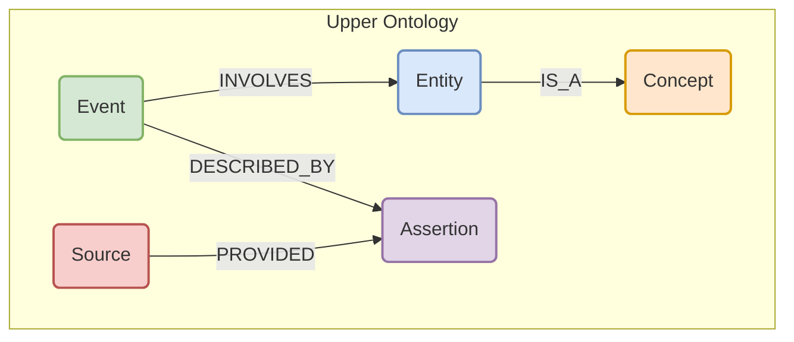
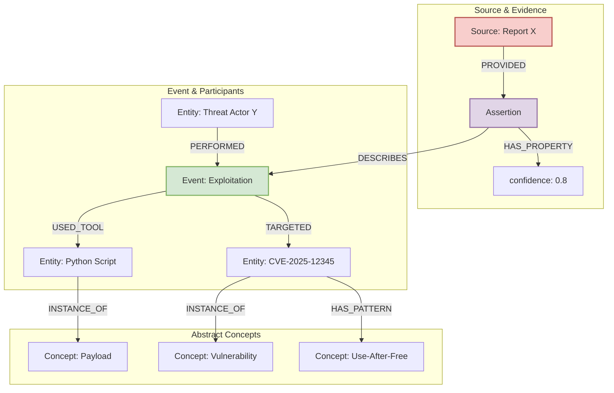
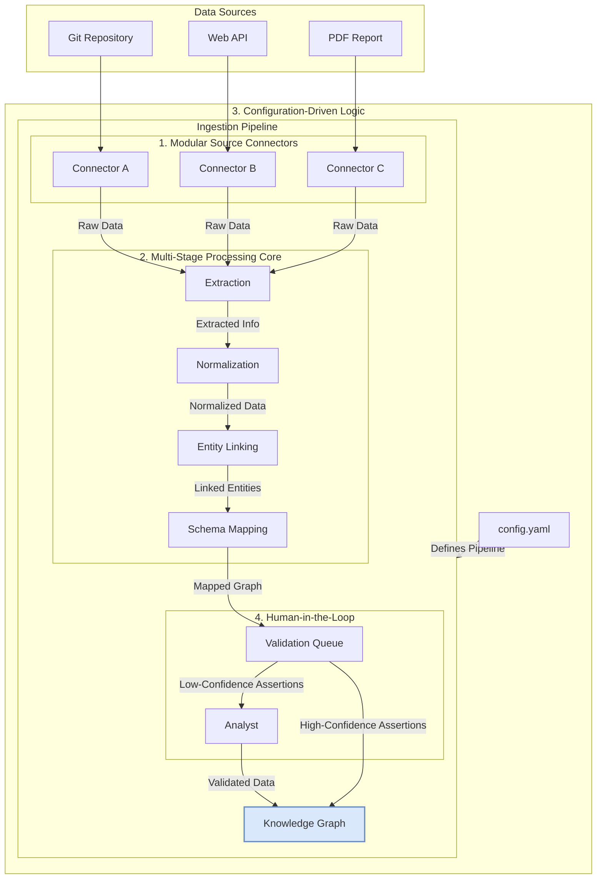

# A Unified Knowledge Graph Architecture for Next-Generation Cybersecurity Intelligence

## 1. Executive Summary

This document presents the final, synthesized proposal for a next-generation cybersecurity knowledge base. It represents the culmination of exhaustive research into advanced graph architectures, data modeling, and ingestion pipelines. The proposed architecture moves decisively away from a rigid, single-ontology model (such as one based solely on MITRE ATT&CK) towards a flexible, extensible, and powerful intelligence system designed to serve as the brain for a predictive security agent.

The core of this proposal is a **Unified Knowledge Graph** built on three foundational principles: a **Multi-Layered Ontology**, **Event-Centric Modeling**, and **Assertion-Based Evidence**. This architecture allows us to unify diverse, heterogeneous data sources—from structured vulnerability feeds and unstructured threat reports to raw exploit code—into a single, coherent, and queryable system.

By explicitly modeling causality, uncertainty, and the provenance of all information, this new architecture provides a robust foundation for advanced reasoning. It is designed not just to store what is known, but to enable the discovery of unknown patterns, the prediction of emerging threats, and the automated generation of actionable intelligence. This proposal outlines the complete end-to-end vision, from the unified schema and ingestion pipeline to the advanced capabilities this system will unlock. Its implementation is of the highest strategic importance for creating a truly intelligent and proactive security posture.

---

## 2. Core Architectural Principles

The unified knowledge graph is founded on three core principles that work in concert to create a flexible, scalable, and powerful system.

1.  **Multi-Layered Ontology:** The schema is divided into two layers: a stable **Upper Ontology** defining abstract, universal concepts (e.g., `ThreatActor`, `Vulnerability`, `Event`), and multiple, flexible **Domain Ontologies** providing rich detail for specific data types (e.g., a `Payload` ontology, a `CVE` ontology). This allows for the rapid integration of new data sources without disrupting the core structure, while the upper ontology ensures all data can be queried in a unified manner.

2.  **Event-Centric Modeling:** Actions and causality are modeled explicitly using `Event` nodes. Instead of directly linking entities (e.g., `ThreatActor` -> `Vulnerability`), we model the action: `(ThreatActor)-[:PERFORMED]->(ExploitationEvent)-[:TARGETED]->(Vulnerability)`. This preserves the crucial narrative context of an attack, makes complex attack chains a natural query path, and provides a framework for temporal reasoning.

3.  **Assertion-Based Evidence:** All information is treated as an assertion from a source, not an absolute truth. Every piece of intelligence is contained within an `Assertion` node, which links to the `Source` (e.g., a specific report) and the `Event` it describes. The `Assertion` node holds metadata like `confidence` scores and `first_seen` timestamps. This makes all knowledge auditable, allows for the representation of conflicting information, and provides a clear mechanism for analysts to weigh evidence.

---

## 3. The Unified Schema

The Unified Schema is the blueprint for our knowledge graph, integrating the core principles into a concrete model. It consists of the Upper Ontology and specialized Domain Ontologies that inherit from it.

### 3.1. The Upper Ontology

The Upper Ontology defines the core, abstract concepts shared across all cybersecurity domains. It provides a stable foundation for integrating diverse data sources.

*   **`Entity`**: Represents a discrete, identifiable actor or object (e.g., a threat actor, a piece of software).
*   **`Event`**: Represents an action or occurrence (e.g., an exploitation event, a disclosure event).
*   **`Concept`**: Represents an abstract class or pattern (e.g., a type of vulnerability like "Use-After-Free").
*   **`Source`**: Represents the origin of information (e.g., a PDF report, a threat intel feed).
*   **`Assertion`**: Represents a specific claim made by a `Source` about an `Event`.

### 3.2. Unified Schema in Action

This example illustrates how the unified schema represents a complex piece of intelligence: *"A report from Source X asserts with 80% confidence that Threat Actor Y used a specific Python script to exploit CVE-2025-12345, which is an instance of a Use-After-Free pattern."*

This model fully captures the scenario by linking the `Source` to the `Assertion`, the `Assertion` to the `Event`, and the `Event` to its participating `Entities`, which are themselves instances of abstract `Concepts`.

---

## 4. The Ingestion Architecture

The ingestion pipeline is a modular, configuration-driven system designed to populate the unified schema from diverse sources.

The key components are:

*   **Modular Source Connectors:** A plug-in architecture for connectors, each responsible for fetching data from a specific source (e.g., Git, API, PDF).
*   **Multi-Stage Processing Core:** An orchestration of modular processing stages:
    *   **Extraction:** Applies type-specific techniques (e.g., Tree-sitter for code, fine-tuned NER and LLMs for text) to extract structured information.
    *   **Normalization:** Transforms extracted data into a standardized intermediate format.
    *   **Entity Linking:** Resolves extracted entities against existing nodes in the graph to prevent duplication.
    *   **Schema Mapping:** Maps the normalized data to the Unified Graph Schema, creating `Event` and `Assertion` nodes.
*   **Configuration-Driven Logic:** A central configuration file defines which sources, connectors, and processing stages to use, allowing for flexibility without code changes.
*   **Human-in-the-Loop:** A validation queue flags low-confidence assertions for manual review by an analyst, ensuring data quality and providing a feedback loop for model improvement.

---

## 5. Advanced Capabilities

This new architecture is not just a more organized repository; it is an engine for advanced reasoning and discovery.

*   **Understanding Zero-Day Patterns:** By modeling the entire lifecycle of vulnerabilities and linking concrete CVEs to abstract `VulnerabilityPatterns` (e.g., `Use-After-Free`, `JNDI_Injection`), the graph enables reasoning across different software and time periods. It allows us to ask questions like, "What `DiscoveryTechniques` are most effective at finding `JNDI_Injection` vulnerabilities?" or "What `Indicators` typically precede the discovery of a new `Use-After-Free` exploit?" This is the foundation for a predictive capability.

*   **Generalizing from Known Data:** The multi-layered ontology allows the system to generalize from specific instances to abstract concepts. For example, by analyzing hundreds of `Payload` instances from code repositories, the system can learn the common characteristics of `SQLi` payloads that target `MySQL`. When a new, unseen payload is ingested, it can be classified and understood based on these learned patterns, even if it uses novel techniques.

*   **Narrative Intelligence:** The event-centric model transforms flat threat reports into dynamic, queryable attack narratives. Analysts can trace attack chains, identify common sequences of TTPs, and ask complex questions like, "Show me all attack paths where `InitialAccessEvent` involving `Phishing` led to a `LateralMovementEvent` within 24 hours."

---

## 6. Conclusion & Next Steps

The proposed Unified Knowledge Graph architecture provides a robust, scalable, and extensible foundation for a next-generation cybersecurity intelligence platform. By moving beyond rigid schemas and embracing a model that explicitly represents causality, uncertainty, and evidence, we are building a system capable of not just storing information, but generating true, predictive intelligence. This is the critical infrastructure required to build a proactive security agent that can anticipate and neutralize threats before they materialize.

The immediate next steps for implementation are:

1.  **Establish the Ontology Working Group (OWG):** Form a small, dedicated team to formally govern the Upper Ontology and the process for creating and versioning Domain Ontologies.
2.  **Implement the Core Infrastructure:** Begin the development of the tri-partite data architecture (Property Graph, Object Store, Search Index) and the foundational ingestion pipeline code.
3.  **Develop Initial Connectors and Domain Ontologies:** Start with two high-impact data sources: a vulnerability feed (e.g., NVD) and a code repository (e.g., PayloadAllTheThings). Develop the corresponding connectors and the initial `Vulnerability` and `Payload` domain ontologies.
4.  **Build the Analyst Validation Interface:** Create the initial web-based UI for the human-in-the-loop validation queue.

This marks the completion of the deep exploration and research phase. The final architectural document is now ready for review and the commencement of the implementation phase.