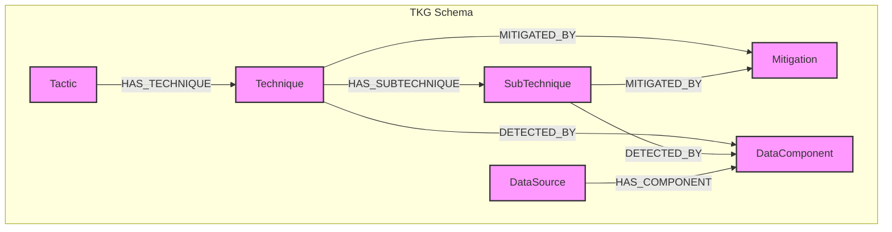

# Project TKG: Formal Graph Schema Specification

**Version:** 1.0
**Date:** 2025-07-24
**Status:** Final

## 1. Introduction

This document provides the formal specification for the Project TKG graph schema. It is the primary deliverable for Phase 2 and is based on the foundational principles and schema adopted in the `STATE_OF_THE_ART_AND_GAP_ANALYSIS.md` report. The schema is a direct formalization of the ETL logic implemented in the `src/ingestion/tkg_importer.py` script.

The purpose of this specification is to provide a comprehensive, machine-readable, and human-understandable definition of the graph's structure, ensuring consistency and clarity for all development, integration, and query activities.

### 1.1. Core Principles

The schema adheres to the following core principles:

*   **Technique-Centric:** The model exclusively imports and represents MITRE ATT&CK techniques, tactics, mitigations, and data sources. It is designed to capture the relationships between adversarial behaviors and the means to detect and mitigate them.
*   **Detection-Focused:** The schema is optimized to model the critical relationships between techniques and their detection mechanisms, specifically through the `DataComponent` and `DataSource` nodes.
*   **Exclusion Mandate:** To maintain a sharp focus and avoid the complexities of modeling temporal or attributional data, this schema explicitly forbids the creation of nodes representing `ThreatGroup`, `Campaign`, `Software`, `Malware`, or any other temporal entities.

## 2. Schema Visualization

The following diagram illustrates the formal relationships between the nodes in the TKG schema.



## 3. Node Definitions

This section details the labels and properties for each node type in the schema. Properties are derived directly from the MITRE ATT&CK Enterprise Matrix via the `tkg_importer.py` script.

### 3.1. `Tactic`

Represents a high-level tactical goal of an adversary, such as "Initial Access" or "Execution."

| Property      | Type   | Description                               | Example                  |
|---------------|--------|-------------------------------------------|--------------------------|
| `id`          | String | The unique identifier (tactic name).      | `initial-access`         |
| `name`        | String | The full name of the tactic.              | `Initial Access`         |
| `shortname`   | String | The short name of the tactic.             | `initial-access`         |
| `description` | String | The official description from MITRE.      | `The adversary is...`    |
| `url`         | String | The URL to the official MITRE documentation. | `https://attack.mitre.org/...` |

### 3.2. `Technique` / `SubTechnique`

Represents a specific adversarial technique or sub-technique. Both are stored with the `Technique` label, differentiated by the `is_subtechnique` property.

| Property            | Type    | Description                                                 | Example                  |
|---------------------|---------|-------------------------------------------------------------|--------------------------|
| `id`                | String  | The unique MITRE ATT&CK ID.                                 | `T1548`                  |
| `stix_id`           | String  | The unique STIX 2.1 identifier.                             | `attack-pattern--...`    |
| `name`              | String  | The full name of the technique.                             | `Abuse Elevation Control Mechanism` |
| `description`       | String  | The official description from MITRE.                        | `Adversaries may...`     |
| `url`               | String  | The URL to the official MITRE documentation.                | `https://attack.mitre.org/...` |
| `is_subtechnique`   | Boolean | `true` if the node is a sub-technique, otherwise `false`.   | `true`                   |

### 3.3. `Mitigation`

Represents a security control or action that can mitigate one or more techniques.

| Property      | Type   | Description                               | Example                  |
|---------------|--------|-------------------------------------------|--------------------------|
| `id`          | String | The unique MITRE ATT&CK ID.               | `M1047`                  |
| `stix_id`     | String | The unique STIX 2.1 identifier.           | `course-of-action--...`  |
| `name`        | String | The full name of the mitigation.          | `Audit`                  |
| `description` | String | The official description from MITRE.      | `System auditing can be...`|

### 3.4. `DataSource`

Represents a source of data that can be collected to detect adversarial activity.

| Property      | Type   | Description                               | Example                  |
|---------------|--------|-------------------------------------------|--------------------------|
| `id`          | String | The unique MITRE ATT&CK ID.               | `DS0017`                 |
| `stix_id`     | String | The unique STIX 2.1 identifier.           | `x-mitre-data-source--...`|
| `name`        | String | The full name of the data source.         | `Command`                |
| `description` | String | The official description from MITRE.      | `Adversaries may execute...`|

### 3.5. `DataComponent`

Represents a specific field or element within a `DataSource`.

| Property      | Type   | Description                               | Example                  |
|---------------|--------|-------------------------------------------|--------------------------|
| `id`          | String | The unique STIX 2.1 identifier.           | `x-mitre-data-component--...` |
| `name`        | String | The full name of the data component.      | `Command Execution`      |
| `description` | String | The official description from MITRE.      | `Execution of commands...` |

## 4. Relationship Definitions

This section defines the directed relationships that connect the nodes in the graph.

| Source         | Relationship         | Target          | Description                                            |
|----------------|----------------------|-----------------|--------------------------------------------------------|
| `(:Tactic)`    | `-[:HAS_TECHNIQUE]->` | `(:Technique)`  | A Tactic is composed of one or more Techniques.        |
| `(:Technique)` | `-[:HAS_SUBTECHNIQUE]->`| `(:Technique)`  | A Technique can have one or more Sub-techniques.       |
| `(:Technique)` | `-[:MITIGATED_BY]->` | `(:Mitigation)` | A Technique can be mitigated by one or more Mitigations. |
| `(:Technique)` | `-[:DETECTED_BY]->`  | `(:DataComponent)`| A Technique can be detected by observing a Data Component. |
| `(:DataSource)`| `-[:HAS_COMPONENT]->`| `(:DataComponent)`| A DataSource is composed of one or more Data Components. |

*Note: The `(:Technique)` - `[:MITIGATED_BY]` -> `(:Mitigation)` relationship also applies to Sub-techniques.*

## 5. Machine-Readable Schema (Cypher DDL)

The following Cypher Data Definition Language (DDL) statements can be used to enforce the schema's structure and constraints in a Neo4j database.

```cypher
-- Create constraints for unique identification and performance
CREATE CONSTRAINT ON (t:Tactic) ASSERT t.name IS UNIQUE;
CREATE CONSTRAINT ON (t:Technique) ASSERT t.id IS UNIQUE;
CREATE CONSTRAINT ON (m:Mitigation) ASSERT m.id IS UNIQUE;
CREATE CONSTRAINT ON (ds:DataSource) ASSERT ds.id IS UNIQUE;
CREATE CONSTRAINT ON (dc:DataComponent) ASSERT dc.id IS UNIQUE;

-- Optional: Create indexes for faster lookups on common properties
CREATE INDEX ON :Technique(name);
CREATE INDEX ON :Mitigation(name);
CREATE INDEX ON :DataSource(name);
CREATE INDEX ON :DataComponent(name);