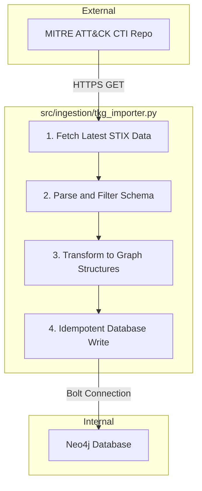

# Technical Implementation Blueprint: Project TKG

**Version:** 1.0
**Date:** 2025-07-24
**Status:** Final

## 1. Introduction

This document provides the complete technical blueprint for the implementation of the Project TKG knowledge graph. It is intended for solution architects and the development team, providing a practical and actionable guide to building and operationalizing the system.

This blueprint is the primary deliverable of the project's design phase and is based on the foundational decisions established in the `STATE_OF_THE_ART_AND_GAP_ANALYSIS.md` and the `docs/FORMAL_GRAPH_SCHEMA_SPECIFICATION.md`.

## 2. Technology Stack Recommendation

This section formalizes the technology choices for the project, providing justifications based on the project's specific requirements.

### 2.1. Graph Database: Neo4j

**Recommendation:** The project will use **Neo4j** as its graph database.

**Justification:**
The choice to formalize Neo4j is based on a comprehensive evaluation of its capabilities against the project's needs, as identified in the gap analysis. While the reference implementation `src/ingestion/tkg_importer.py` already uses Neo4j, this decision is now confirmed for the following reasons:

1.  **Query Language Expressiveness (Cypher):** Neo4j's query language, Cypher, is a declarative, pattern-matching language that is highly intuitive for graph traversal. Its ASCII-art-like syntax makes it easy to express complex relationships and queries, which is critical for the ZEN reasoning layer. When compared to alternatives like Gremlin (imperative) or SPARQL (RDF-focused), Cypher provides a more direct and readable way to model the intricate paths required by security analysts.

2.  **Scalability and Performance:** Neo4j is a native graph database, meaning it stores data in a graph structure from the ground up. This results in index-free adjacency, allowing for extremely fast traversal of relationships regardless of the total dataset size. For a knowledge graph that will grow with the MITRE ATT&CK framework and potentially other sources, this performance characteristic is paramount.

3.  **Ease of Integration and Ecosystem:** Neo4j has a mature ecosystem with robust client libraries for major programming languages, including the Python driver used in the reference importer. Its strong community support, extensive documentation, and enterprise-ready features (e.g., clustering, security, monitoring) make it a low-risk, high-reward choice for a production system.

## 3. Automated Ingestion Pipeline

This section formally documents the design of the automated ingestion pipeline, which is responsible for populating and maintaining the knowledge graph.

### 3.1. Reference Implementation

The official reference implementation for the ingestion pipeline is the Python script located at `src/ingestion/tkg_importer.py`. All development must adhere to the principles and patterns established in this script.

### 3.2. Pipeline Architecture

The ingestion pipeline is designed as a four-stage process, ensuring data integrity, performance, and idempotency.



### 3.3. Key Functions

1.  **Fetching Latest Dataset:** The pipeline initiates by making an HTTP GET request to the official MITRE CTI repository to download the latest Enterprise ATT&CK dataset in STIX 2.1 format. This ensures the graph is always built from the most current, authoritative source.

2.  **Parsing and Filtering:** The raw STIX data is loaded into a memory store. During this process, objects are filtered against a strict allow-list (`ALLOWED_TYPES`) to enforce the project's technique-centric schema. Only `attack-pattern`, `course-of-action`, `x-mitre-tactic`, `x-mitre-data-source`, and `x-mitre-data-component` objects are retained.

3.  **Transforming to Graph-Native Structures:** The filtered STIX objects are transformed into a format suitable for Neo4j. This involves extracting key properties and preparing them for batch import as nodes and relationships that conform to the `FORMAL_GRAPH_SCHEMA_SPECIFICATION.md`.

4.  **Idempotent Database Writing:** The transformed data is written to the Neo4j database using an idempotent `MERGE` operation. This ensures that running the import multiple times will not create duplicate nodes or relationships. The process is batched by node and relationship type for high performance and reliability, and it begins by clearing the database to ensure a fresh, consistent state with each run.

## 4. ZEN Reasoning Layer Integration

This section specifies how the "ZEN agent," a natural language query and reasoning interface, will be integrated with the knowledge graph. The core of this integration is the translation of complex analyst queries into optimized Cypher.

### 4.1. Query Translation Examples

Below are five distinct and complex natural language query examples, along with the optimized Cypher queries that the ZEN agent must generate.

---

**Query 1: Multi-Tactic Attack Path**

*   **Natural Language:** "Show me a potential attack path from 'Initial Access' to 'Exfiltration' that uses techniques detectable by 'Process Monitoring' and 'File Monitoring'. What are the techniques and the data components that would detect them?"

*   **Optimized Cypher:**
    ```cypher
    MATCH path = (tactic1:Tactic {name: 'Initial Access'})-[:HAS_TECHNIQUE*2..5]-(tactic2:Tactic {name: 'Exfiltration'})
    WITH path, nodes(path) AS pathNodes
    UNWIND pathNodes AS node
    WITH path, node, pathNodes
    WHERE node:Technique
    MATCH (node)-[:DETECTED_BY]->(dc:DataComponent)
    WHERE dc.name IN ['Process Monitoring', 'File Monitoring']
    WITH path, collect(DISTINCT node) AS techniques, collect(DISTINCT dc) AS components
    WHERE size(techniques) > 1
    RETURN
      [t in techniques | {id: t.id, name: t.name}] AS Techniques,
      [c in components | c.name] AS DetectingComponents,
      length(path) AS PathLength
    ORDER BY PathLength ASC
    LIMIT 10;
    ```

---

**Query 2: Mitigation Coverage Analysis**

*   **Natural Language:** "Which techniques under the 'Credential Access' tactic are NOT mitigated by 'Multi-Factor Authentication'? For those techniques, what are the top 3 suggested mitigations?"

*   **Optimized Cypher:**
    ```cypher
    MATCH (tactic:Tactic {name: 'Credential Access'})-[:HAS_TECHNIQUE]->(tech:Technique)
    WHERE NOT (tech)-[:MITIGATED_BY]->(:Mitigation {name: 'Multi-Factor Authentication'})
    OPTIONAL MATCH (tech)-[:MITIGATED_BY]->(m:Mitigation)
    WITH tech, collect(DISTINCT m) AS mitigations
    RETURN
      tech.id AS TechniqueID,
      tech.name AS TechniqueName,
      [mit IN mitigations[0..3] | {id: mit.id, name: mit.name}] AS SuggestedMitigations
    LIMIT 25;
    ```

---

**Query 3: Data Source Effectiveness**

*   **Natural Language:** "What are the top 5 data sources that provide the broadest detection coverage for techniques associated with both 'Defense Evasion' and 'Lateral Movement' tactics?"

*   **Optimized Cypher:**
    ```cypher
    MATCH (t:Tactic)-[:HAS_TECHNIQUE]->(tech:Technique)
    WHERE t.name IN ['Defense Evasion', 'Lateral Movement']
    MATCH (tech)-[:DETECTED_BY]->(dc:DataComponent)<-[:HAS_COMPONENT]-(ds:DataSource)
    WITH ds, count(DISTINCT tech) AS techniqueCount
    RETURN
      ds.name AS DataSource,
      techniqueCount
    ORDER BY techniqueCount DESC
    LIMIT 5;
    ```

---

**Query 4: High-Impact, Low-Coverage Techniques**

*   **Natural Language:** "Identify techniques that are part of at least three tactics but are only detected by a single data component. These represent high-impact techniques with potentially low detection coverage."

*   **Optimized Cypher:**
    ```cypher
    MATCH (t:Tactic)-[:HAS_TECHNIQUE]->(tech:Technique)
    WITH tech, count(DISTINCT t) AS tacticCount
    WHERE tacticCount >= 3
    MATCH (tech)-[:DETECTED_BY]->(dc:DataComponent)
    WITH tech, tacticCount, count(DISTINCT dc) AS detectionCount
    WHERE detectionCount = 1
    RETURN
      tech.id AS TechniqueID,
      tech.name AS TechniqueName,
      tacticCount,
      detectionCount
    ORDER BY tacticCount DESC;
    ```

---

**Query 5: Complex Threat Scenario**

*   **Natural Language:** "I'm investigating a threat that starts with 'Phishing', moves to 'Command and Scripting Interpreter', and is mitigated by 'User Training'. What data sources could detect this chain, and what are the specific techniques involved?"

*   **Optimized Cypher:**
    ```cypher
    MATCH path = (t1:Technique {name: 'Phishing'})-[*1..4]-(t2:Technique {name: 'Command and Scripting Interpreter'})
    WITH path, nodes(path) AS pathNodes
    UNWIND pathNodes AS node
    WITH path, node
    WHERE node:Technique
    MATCH (node)-[:MITIGATED_BY]->(:Mitigation {name: 'User Training'})
    MATCH (node)-[:DETECTED_BY]->(dc:DataComponent)<-[:HAS_COMPONENT]-(ds:DataSource)
    WITH path, collect(DISTINCT node) AS techniques, collect(DISTINCT ds.name) AS dataSources
    RETURN
      [t in techniques | {id: t.id, name: t.name}] AS InvolvedTechniques,
      dataSources AS DetectingDataSources,
      length(path) AS PathLength
    ORDER BY PathLength
    LIMIT 10;