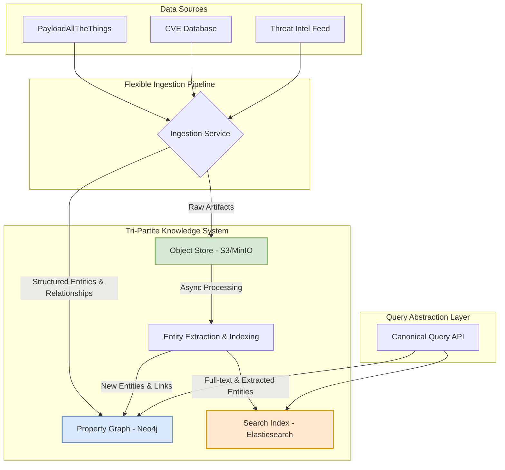

# Advanced Knowledge Graph Architectures for Cybersecurity Intelligence

## 1. Introduction

This document presents research into advanced knowledge graph architectures designed to overcome the limitations of a single, rigid ontology like the MITRE ATT&CK framework. The goal is to design a more flexible, extensible, and powerful intelligence system that can unify diverse data sources, represent uncertainty, and evolve over time.

## 2. Research Areas

This research focuses on four key areas:

*   **Flexible Ontologies:** Moving beyond a single backbone to support multiple, evolving schemas.
*   **Federated & Multi-Layered Graphs:** Architectures for integrating disparate knowledge domains.
*   **Representing Uncertainty & Evolution:** Modeling confidence, conflicts, and the temporal nature of threats.
*   **Cross-Domain Inspiration:** Learning from successful knowledge graphs in other complex fields.

---

*This document is a work in progress and will be updated as research is conducted.*
---

## 3. Findings: Flexible Ontologies & Hybrid Architectures

The primary limitation of the "spina dorsale" model is its rigidity. To overcome this, a **multi-layered ontology architecture** is recommended. This model moves away from a single, monolithic schema towards a more flexible "web of ontologies."

### 3.1. The Multi-Layered Ontology Model

This model consists of two primary layers:

*   **Upper Ontology:** A high-level, stable ontology that defines core, abstract concepts shared across all cybersecurity domains (e.g., `ThreatActor`, `Vulnerability`, `Tool`, `Technique`). A standard like the **Unified Cyber Ontology (UCO)** is a strong starting point.
*   **Domain Ontologies:** Multiple, independent, and specialized schemas that provide rich detail for specific data sources (e.g., a `PayloadAllTheThings` ontology, a `CVE` ontology, a `Whitepaper` ontology). These ontologies inherit from and map to the upper ontology.

This approach allows for the rapid integration of new data sources without requiring changes to the core schema, while the upper ontology ensures all data can be queried in a unified manner.

### 3.2. The Tri-Partite Data Architecture

To support this flexible ontology model and efficiently handle both structured and unstructured data, a tri-partite architecture is proposed:

1.  **Property Graph (e.g., Neo4j):** The source of truth for structured entities and their relationships. This is the core knowledge graph.
2.  **Object Store (e.g., S3, MinIO):** The repository for raw, unstructured artifacts (e.g., binaries, PCAP files, PDF reports). The graph stores pointers (URIs) to these artifacts, not the blobs themselves.
3.  **Search Index (e.g., Elasticsearch):** An engine for full-text search and schema-on-read. An asynchronous pipeline processes artifacts from the object store, extracts entities, and indexes the content.



### 3.3. Governance and Querying

*   **Governance:** A lightweight **Ontology Working Group (OWG)** should be established to manage the lifecycle of domain ontologies through a formal change proposal process (e.g., via Git). All ontology modules must be versioned.
*   **Querying:** A **Query Abstraction Layer** (a library of canonical, parameterized queries) should be developed. This allows analysts to query the system using simple business logic (e.g., `get_actor_infrastructure('APT41')`) without needing to understand the complexities of the underlying multi-ontology structure.

This architecture provides a robust and scalable foundation for a next-generation cybersecurity intelligence system.
---

## 4. Findings: Federated & Multi-Layered Architectures

Building on the multi-layered ontology, a **hybrid federation model** is the recommended architecture for the knowledge graph itself. This approach provides a pragmatic balance between data centralization and decentralization, optimizing for both performance and data freshness.

### 4.1. The Hybrid Federation Model

This model combines two federation strategies:

*   **Materialized Federation:** High-value, frequently accessed, or relatively static data from external sources is physically imported and stored in the central knowledge graph. This provides the best query performance.
*   **Virtual Federation:** A federated query engine is used to access less frequently used or highly dynamic data from external sources in real-time. This ensures data is always up-to-date without the overhead of a full ingestion pipeline.

A **decision framework** should be established to determine the appropriate strategy for each data source, based on factors like query frequency, data volatility, and the cost of ingestion.

### 4.2. Federated Query Engine

A critical component of this architecture is a **federated query engine**. This engine acts as an abstraction layer, providing a single interface for querying both materialized and virtualized data. It is responsible for:

1.  **Query Decomposition:** Breaking down a user's query into sub-queries that target the appropriate data sources (the central graph or an external source).
2.  **Sub-Query Execution:** Executing the sub-queries against the target data sources.
3.  **Results Aggregation:** Combining the results from the sub-queries into a single, unified result set.

This engine hides the complexity of the underlying distributed architecture from the end-user, providing a seamless query experience.

### 4.3. Governance in a Federated System

In a federated environment, robust governance is essential. This includes:

*   **Data Ownership:** Clear ownership must be defined for each data source.
*   **Access Control:** A centralized access control model should be implemented to ensure that users can only access the data they are authorized to see, regardless of where it is stored.
*   **Data Quality:** A framework for monitoring and ensuring the quality of data from external sources must be established.

This hybrid federation model, combined with the multi-layered ontology, provides a powerful and flexible architecture for building a comprehensive and distributed cybersecurity intelligence system.
---

## 5. Findings: Representing Uncertainty, Confidence & Temporal Evolution

Cybersecurity intelligence is characterized by uncertainty, conflicting evidence, and constant change. A robust knowledge graph must be able to model these nuances. A hybrid approach, combining several modeling patterns, is recommended.

### 5.1. Modeling Uncertainty and Confidence

Two primary patterns are recommended for modeling uncertainty and confidence:

*   **Pattern 1: Properties on Relationships (The 90% Solution):** For most use cases, adding metadata directly to relationships is the simplest and most efficient approach.
    *   **Use for:** `confidence` scores, `source` attribution, `first_seen`/`last_seen` timestamps.
    *   **Example:**
        ```cypher
        (m:Malware)-[:ATTRIBUTED_TO {confidence: 0.85, source: 'Vendor X'}]->(ta:ThreatActor)
        ```

*   **Pattern 2: The "Evidence" Node (Reification - The 10% Solution):** This more complex pattern should be reserved for specific situations where a simple relationship is insufficient.
    *   **Use ONLY when:**
        1.  You have **conflicting information** from different sources.
        2.  You need to attach **complex, multi-faceted evidence** to a claim.
    *   **Example:**
        ```cypher
        (e:Evidence)-[:SUBJECT]->(m:Malware)
        (e)-[:PREDICATE]->(:ATTRIBUTED_TO)
        (e)-[:OBJECT]->(ta:ThreatActor)
        (r:Report)-[:MAKES_CLAIM]->(e)
        ```

### 5.2. Modeling Temporal Evolution

Capturing the temporal nature of threats is critical. Two primary patterns are recommended:

*   **Temporal Properties:** For simple use cases, adding `start_date` and `end_date` properties to nodes and relationships is sufficient.
*   **Event Sourcing:** For more complex scenarios where the evolution of an entity or relationship is important, an event sourcing pattern can be used. In this pattern, the graph stores a log of events that have occurred, and the current state of the graph is derived from this log. This is a powerful but complex pattern that should be used judiciously.

By combining these patterns, the knowledge graph can accurately represent the complex, dynamic, and uncertain nature of cybersecurity intelligence.
---

## 6. Findings: Cross-Domain Inspiration

The challenges of building a large-scale knowledge graph are not unique to cybersecurity. By examining successful projects in other complex domains, we can identify and adopt proven architectural patterns and best practices.

### 6.1. Common Architectural Patterns

Across domains like bioinformatics, finance, and logistics, several common architectural patterns have emerged in successful large-scale knowledge graphs:

*   **Multi-Layered Ontologies:** As detailed in section 3, the separation of a stable upper ontology from more dynamic domain ontologies is a near-universal pattern.
*   **Hybrid Federation:** The combination of materialized and virtualized data sources is a common strategy for balancing performance and data freshness.
*   **Event-Driven Architectures:** Many large-scale knowledge graphs are built on event-driven architectures, where changes to the graph are triggered by events from upstream systems.

### 6.2. Best Practices for Governance

The success of a large-scale knowledge graph is as much about governance as it is about technology. The following best practices are common to successful projects in other domains:

*   **Federated Governance:** As detailed in section 4, a federated governance model, with a central team responsible for the upper ontology and domain teams responsible for their own ontologies, is a common pattern.
*   **Data Ownership:** Clear ownership is established for every data source and every part of the ontology.
*   **Automated Data Quality Monitoring:** Successful projects invest heavily in automated data quality monitoring to ensure the reliability of the knowledge graph.

### 6.3. Organizational Structures

The organizational structure that supports the knowledge graph is also a key factor in its success. Common patterns include:

*   **A Central Knowledge Graph Team:** A dedicated team is responsible for the core infrastructure, the upper ontology, and the overall health of the knowledge graph.
*   **Embedded Graph Experts:** Graph experts are embedded in domain teams to help them model their data and integrate it into the knowledge graph.
*   **A Strong Community of Practice:** Successful projects foster a strong community of practice around the knowledge graph, with regular meetings, training sessions, and a shared repository of best practices.

By adopting these proven patterns and best practices, we can significantly increase the chances of success for our own cybersecurity intelligence knowledge graph.