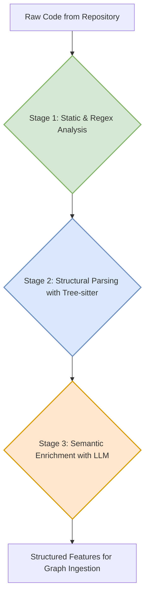
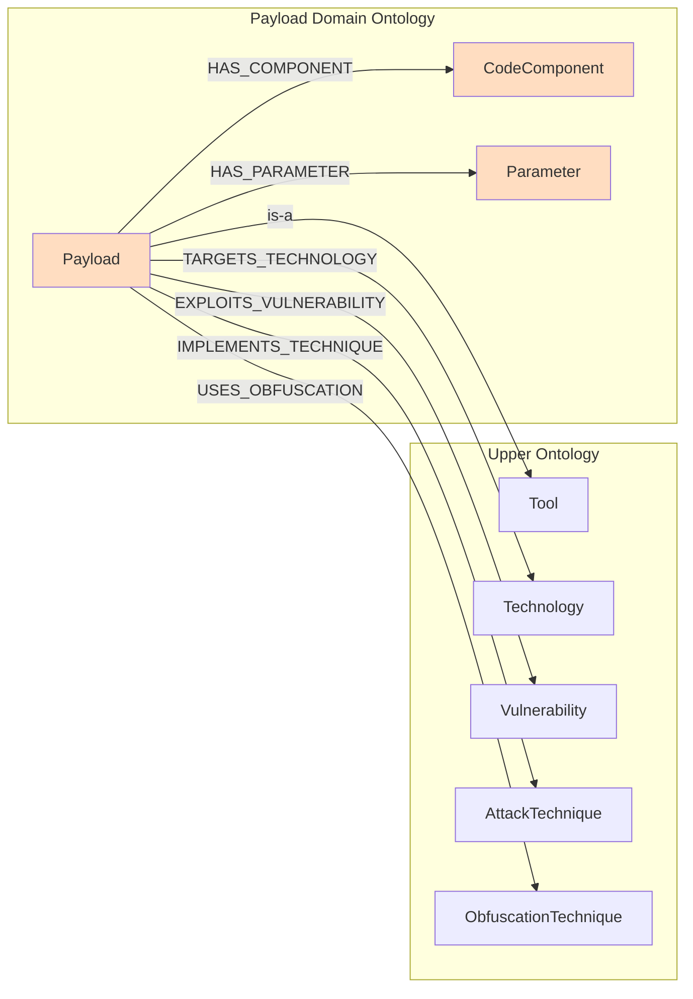

# Payload Domain Ontology: A Model for Integrating Code-Centric Knowledge

## 1. Introduction

This document proposes a "Payload Domain Ontology" for integrating knowledge from code-centric repositories like "PayloadAllTheThings" into our multi-layered knowledge graph. This model is designed to be flexible, extensible, and compatible with the advanced graph architecture outlined in [`ADVANCED_GRAPH_ARCHITECTURES.md`](docs/knowledge_base_research/ADVANCED_GRAPH_ARCHITECTURES.md).

The core challenge is to parse, model, and link heterogeneous exploit code—from one-line commands to complex scripts—to abstract cybersecurity concepts in a structured and scalable manner. This ontology provides a framework for achieving that goal.

## 2. Automated Code Feature Extraction

To effectively model payloads, we must first extract meaningful features from the raw code. A hybrid, multi-stage pipeline is proposed for this purpose:

*   **Stage 1: Initial Triage (Static & Regex Analysis):** This stage performs a fast, initial pass to extract simple, high-confidence indicators of compromise (IOCs).
    *   **Examples:** IP addresses, domain names, file hashes, common command-line tools (e.g., `curl`, `wget`).

*   **Stage 2: Structural Parsing (Tree-sitter):** We will use `tree-sitter` to parse the code into a Concrete Syntax Tree (CST). This provides a robust, language-aware understanding of the code's structure.
    *   **Examples:** Identifying function calls, imported libraries, variable assignments, and string literals.

*   **Stage 3: Semantic Enrichment (LLM-based Analysis):** A Large Language Model (LLM) will analyze the raw code and its corresponding CST to infer higher-level semantic meaning.
    *   **Examples:** Identifying the payload's intent (e.g., "time-based blind SQLi"), the target technology (e.g., "MySQL"), detecting signs of obfuscation, and proposing links to abstract concepts in the Upper Ontology.

## 3. Graph Modeling for Payloads

The extracted features will be modeled in the graph using the following schema. This "Payload Domain Ontology" inherits from and extends the Upper Ontology (e.g., UCO).

### 3.1. Core Schema

### 3.2. Node Definitions

*   **`Payload` (sub-class of UCO `Tool`):** The central node representing a specific exploit or piece of code.
    *   **Properties:**
        *   `name`: A human-readable name for the payload.
        *   `description`: A summary of the payload's purpose.
        *   `raw_content`: The raw source code (for smaller snippets).
        *   `language`: The programming language (e.g., `python`, `bash`).
        *   `payload_type`: The general category of the payload (e.g., `RCE`, `XSS`, `SQLi`).
        *   `confidence`: The confidence score in the accuracy of the extracted data.
        *   `source_uri`: A pointer to the raw artifact in the Object Store (for larger files).

*   **`CodeComponent`:** Represents a significant, self-contained part of a larger payload, such as a function, class, or module. This allows for the decomposition of complex scripts.
    *   **Properties:** `name`, `code_block`, `description`.

*   **`Parameter`:** Represents a configurable or user-supplied part of a payload.
    *   **Properties:** `name`, `description`, `default_value`.

### 3.3. Handling Heterogeneity

This model is designed to handle the wide variety of content in exploit repositories:
*   **One-Line Commands:** Are stored in a single `Payload` node, with the command in the `raw_content` property.
*   **Complex Scripts:** Are represented by a primary `Payload` node linked to multiple `CodeComponent` nodes (for functions/classes) and `Parameter` nodes (for arguments).

## 4. Linking Code to Concepts

A key goal is to link these concrete `Payload` entities to abstract concepts in the Upper Ontology. A multi-faceted strategy is proposed to achieve this:

1.  **LLM-based Candidate Generation:** During the feature extraction phase, the LLM will propose candidate relationships (e.g., `IMPLEMENTS_TECHNIQUE`) to concepts in the Upper Ontology based on its analysis of the code.

2.  **Embedding-based Similarity Search:** To enhance and validate these links, we will generate vector embeddings for both the code (`Payload` nodes) and the descriptions of our conceptual entities (e.g., `AttackTechnique` nodes). A similarity search between these embeddings will identify the most relevant conceptual links.

3.  **Human-in-the-Loop Validation:** All automatically generated links will be treated as claims with a confidence score. These claims will be presented to a human analyst in a review queue for validation. This feedback is crucial for fine-tuning the models and ensuring the quality of the knowledge graph.

## 5. Conclusion

This proposed "Payload Domain Ontology" provides a robust and flexible framework for integrating code-centric knowledge into our cybersecurity intelligence platform. By combining a multi-stage feature extraction pipeline with a detailed and extensible graph schema, we can transform unstructured code into a rich source of structured, actionable intelligence.