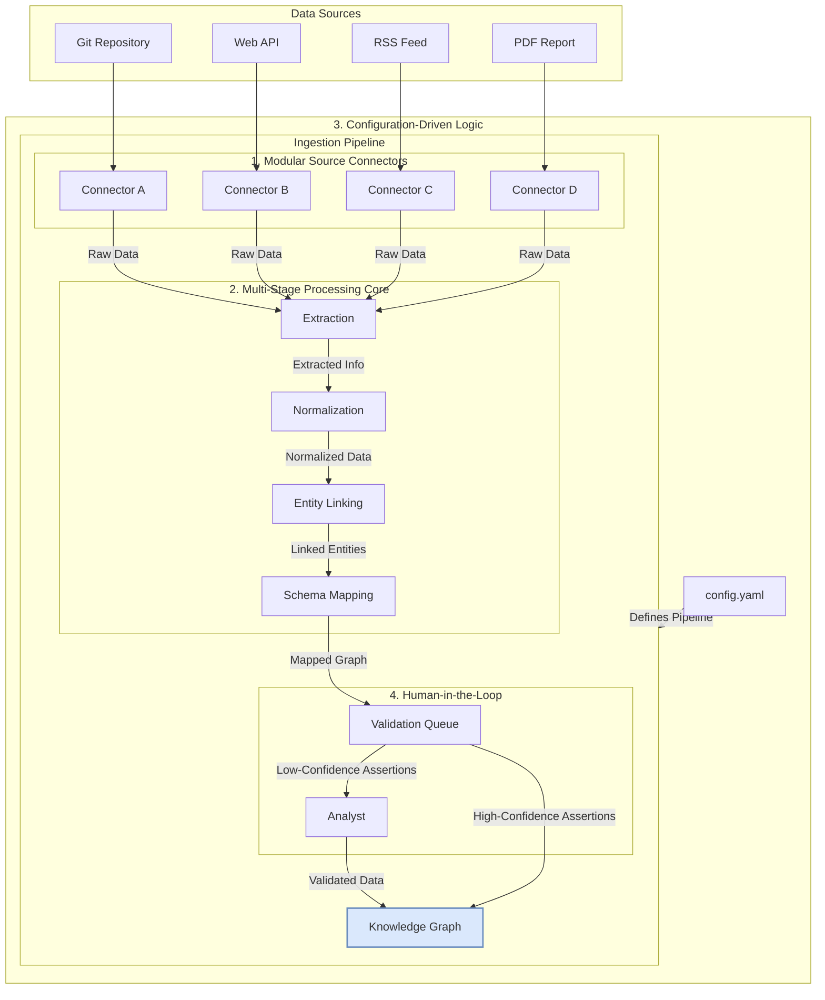

# A Flexible, Multi-Source Data Ingestion Pipeline Architecture

## 1. Introduction

This document specifies the architecture for a flexible, multi-source data ingestion pipeline. Its purpose is to process diverse data types (e.g., code repositories, unstructured reports, vulnerability feeds) and map them to the `UNIFIED_GRAPH_SCHEMA.md`. This design is synthesized from our comprehensive research into advanced graph architectures, code integration, unstructured data processing, and the zero-day vulnerability lifecycle.

## 2. High-Level Architecture

The ingestion pipeline is designed as a modular, configuration-driven system that orchestrates a series of processing stages. The following diagram illustrates the complete data flow, from raw source to the populated knowledge graph.

## 3. Modular Source Connectors

The pipeline features a plug-in architecture for `Connectors`, where each connector is responsible for fetching data from a specific source.

*   **Interface:** Each connector must implement a standard interface (e.g., a Python abstract base class) with a `fetch()` method that returns raw data in a standardized format (e.g., a dictionary with `content` and `metadata` keys).
*   **Examples:**
    *   `GitConnector`: Clones or pulls a repository and iterates through files.
    *   `ApiConnector`: Fetches data from a REST or GraphQL API, handling pagination and authentication.
    *   `RssConnector`: Parses an RSS or Atom feed.
    *   `FileConnector`: Reads and extracts text from local files (e.g., PDF, DOCX).
*   **Configuration:** The main pipeline configuration will specify which connectors to activate and their specific parameters (e.g., repository URL, API endpoint, file path).

## 4. Multi-Stage Processing Core

The core of the pipeline orchestrates a sequence of processing stages, each designed to be modular and extensible.

### 4.1. Stage 1: Extraction

This stage applies the appropriate techniques based on the data type to extract structured information from raw data.

*   **For Code (as per `CODE_INTEGRATION_MODELS.md`):**
    1.  **Static/Regex Analysis:** Fast extraction of IOCs.
    2.  **Tree-sitter Parsing:** Generate a Concrete Syntax Tree (CST).
    3.  **LLM Enrichment:** Infer semantic meaning (e.g., intent, target technology) from the code and CST.
*   **For Unstructured Text (as per `UNSTRUCTURED_DATA_MODELS.md`):**
    1.  **Fine-Tuned NER:** Use models like `CyberBERT` for high-fidelity entity identification.
    2.  **LLM Relationship Extraction:** Use a powerful LLM to classify relationships between the identified entities.

### 4.2. Stage 2: Normalization

This stage transforms the extracted information into a standardized intermediate format, independent of the source. This format will be a simple, graph-like structure of nodes and edges, closely resembling the final schema but without being tied to a specific graph database implementation.

### 4.3. Stage 3: Entity Linking

This stage resolves extracted entities against existing nodes in the graph to avoid duplication. This will be implemented as a multi-stage funnel:

1.  **Candidate Generation:** Use rule-based matching and embedding similarity search to generate a list of potential candidate nodes from the graph.
2.  **LLM-based Disambiguation:** Use an LLM to select the best fit from the candidate list, based on the context of the source data.

### 4.4. Stage 4: Schema Mapping

This final processing stage maps the normalized, linked data to the nodes and relationships defined in the `UNIFIED_GRAPH_SCHEMA.md`. This includes:

*   **Event-Centric Modeling:** Transforming actions into `Event` nodes.
*   **Assertion-Based Evidence:** Wrapping all information in `Assertion` nodes, linked to the `Source` and containing metadata like `confidence`.

## 5. Configuration-Driven Logic

The entire pipeline is driven by a central configuration file (e.g., `config.yaml`). This file will define:

*   **Sources:** A list of data sources to process.
*   **Connectors:** Which connector to use for each source, along with its specific parameters.
*   **Pipeline Stages:** Which processing stages to apply to the data from each source.
*   **Schema Mappings:** Rules for mapping the output of the processing stages to the target graph schema.

This approach allows for the flexible addition of new sources and processing techniques without modifying the core pipeline code.

## 6. Human-in-the-Loop Integration

To ensure data quality, the design includes points for human validation.

*   **Validation Queue:** All assertions generated by the pipeline will be sent to a validation queue.
*   **Confidence Threshold:** Assertions with a confidence score below a configurable threshold will be flagged for manual review by an analyst.
*   **Feedback Loop:** The validated data from the analyst will be used to fine-tune the extraction and linking models, creating a continuous improvement loop.
*   **Interface:** A simple web-based interface will be provided for analysts to review, approve, or reject assertions.

This comprehensive, multi-stage architecture provides a robust and extensible framework for populating our cybersecurity knowledge graph from a wide variety of sources.