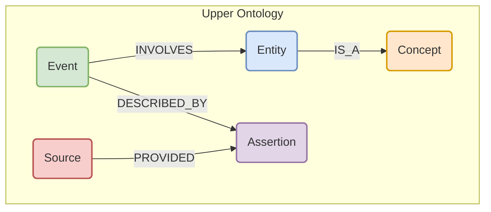
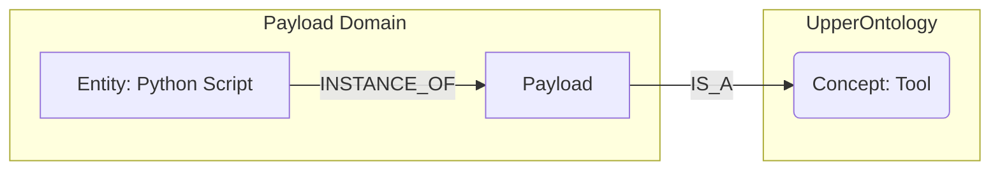
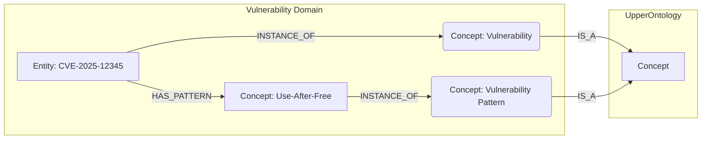
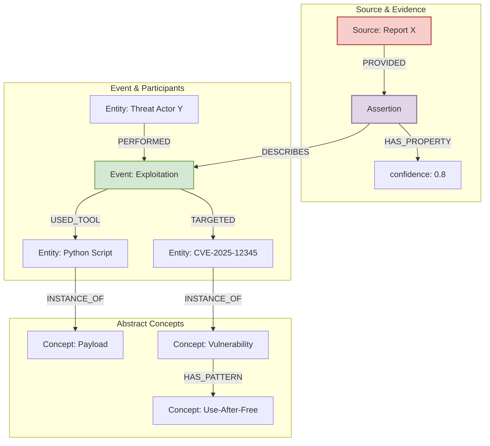

# A Unified Knowledge Graph Schema for Cybersecurity Intelligence

## 1. Introduction

This document presents a unified, multi-layered knowledge graph schema synthesized from our comprehensive research into advanced graph architectures, code integration, unstructured data processing, and the zero-day vulnerability lifecycle. Its purpose is to provide a detailed, evidence-based design for a next-generation cybersecurity intelligence platform.

This schema is built on three core principles designed to create a flexible, scalable, and powerful system for representing complex cybersecurity knowledge.

## 2. Core Principles

The unified schema is founded on the following core principles, derived from our research:

1.  **Multi-Layered Ontology:** The schema is divided into two layers: a stable **Upper Ontology** defining abstract, universal concepts, and multiple, flexible **Domain Ontologies** providing rich detail for specific data types (e.g., payloads, vulnerabilities). This allows for the rapid integration of new data sources without disrupting the core structure.
2.  **Event-Centric Modeling:** Actions and causality are modeled explicitly using `Event` nodes. Instead of directly linking entities (e.g., `ThreatActor` -> `Vulnerability`), we model the action: `(ThreatActor)-[:PERFORMED]->(ExploitationEvent)-[:TARGETED]->(Vulnerability)`. This preserves the narrative context and makes attack chains a natural query path.
3.  **Assertion-Based Evidence:** All information is treated as an assertion from a source, not an absolute truth. Every `Event` is described by one or more `Assertion` nodes, which link to the `Source` and contain metadata like `confidence`. This makes all knowledge auditable and allows for the representation of conflicting information.

## 3. The Upper Ontology

The Upper Ontology defines the core, abstract concepts that are shared across all cybersecurity domains. It provides a stable foundation for integrating diverse data sources.

*   **`Entity`**: Represents a discrete, identifiable actor or object (e.g., a threat actor, a piece of software, a specific payload).
*   **`Event`**: Represents an action or occurrence that happens at a specific point in time (e.g., an exploitation event, a disclosure event).
*   **`Concept`**: Represents an abstract class or pattern (e.g., a type of vulnerability like "Use-After-Free", a type of tool like "Scanner").
*   **`Source`**: Represents the origin of information (e.g., a PDF report, a threat intelligence feed).
*   **`Assertion`**: Represents a specific claim made by a `Source` about an `Event`. This is the cornerstone of our evidence-based model.

## 4. Domain Ontology Integration

Domain Ontologies provide specialized models for specific types of data. They inherit from and extend the Upper Ontology, creating a rich, interconnected web of knowledge.

### 4.1. Payload Domain Ontology

This ontology models knowledge from code-centric sources.

*   A `Payload` is defined as a sub-class of the Upper Ontology's `Tool` concept.
*   A concrete instance, like a specific `Python Script`, is an `Entity` that is an `INSTANCE_OF` the `Payload` concept.

### 4.2. Vulnerability Domain Ontology

This ontology models the complex lifecycle and characteristics of vulnerabilities.

*   `Vulnerability` and `VulnerabilityPattern` are defined as sub-classes of the Upper Ontology's `Concept`.
*   A specific `CVE` is an `Entity` that is an `INSTANCE_OF` a `Vulnerability`.
*   The `CVE` is linked to its abstract `VulnerabilityPattern`.

## 5. Concrete Example: Unified Schema in Action

This example illustrates how the unified schema represents the following scenario: *"A report from Source X asserts with 80% confidence that Threat Actor Y used a specific Python script (the payload) to exploit CVE-2025-12345, which is an instance of a Use-After-Free pattern."*

This model fully captures the scenario:
*   The **`Source`** (`Report X`) provides an **`Assertion`**.
*   The `Assertion` has a **`confidence`** of 0.8 and describes an **`ExploitationEvent`**.
*   The `Event` involves three **`Entity`** nodes: `Threat Actor Y`, the `Python Script`, and `CVE-2025-12345`.
*   Each `Entity` is linked to its abstract **`Concept`**, providing a rich, multi-layered representation of the intelligence.

## 6. Conclusion

This unified graph schema provides a robust and extensible foundation for our cybersecurity intelligence platform. By integrating a multi-layered ontology with event-centric and assertion-based modeling, it allows us to represent complex, uncertain, and evolving knowledge in a structured and queryable format. This design is the key to unlocking a more powerful, predictive, and automated approach to cybersecurity analysis.