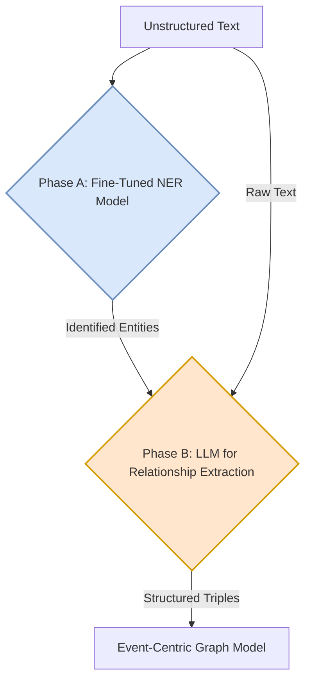
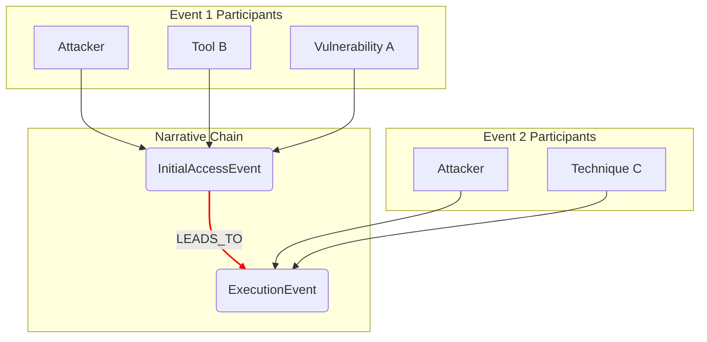
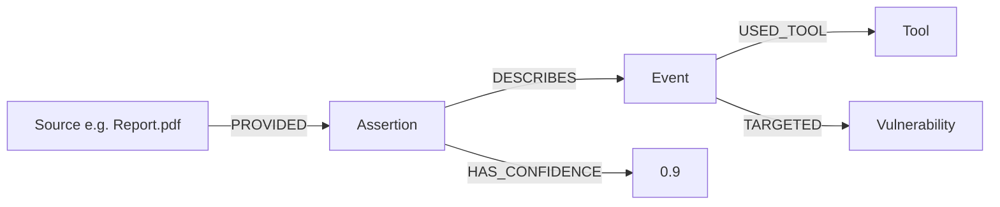

# A Model for Ingesting and Representing Unstructured Text in a Cybersecurity Knowledge Graph

## 1. Introduction

This document proposes a comprehensive model for processing unstructured text sources (e.g., academic whitepapers, penetration testing reports, security write-ups) and integrating them into our multi-layered cybersecurity knowledge graph. It builds upon the principles established in our existing research on advanced graph architectures and code integration.

The central challenge is to transform ambiguous, prose-based intelligence into a structured, evidence-based, and queryable format. This requires a sophisticated approach that goes beyond simple entity extraction to capture complex relationships, narrative causality, and the provenance of information.

This model is presented as a multi-stage pipeline, addressing four key areas:
1.  **Extraction:** How to identify entities and their complex relationships.
2.  **Narrative Modeling:** How to represent the sequence and causality of events.
3.  **Evidential Modeling:** How to treat information as assertions from a source, not absolute truth.
4.  **Integration:** How to link extracted knowledge to our unified graph ontology.

---

## 2. Stage 1: Advanced Entity & Relationship Extraction

The first step is to extract structured information from raw text. We recommend a **hybrid, two-phase extraction pipeline** that leverages the strengths of both specialized NLP models and general-purpose Large Language Models (LLMs).

### 2.1. Phase A: High-Fidelity Entity Extraction (NER)

The initial phase focuses on accurately identifying core cybersecurity entities.

*   **Method:** Use a fine-tuned transformer model (e.g., `CyberBERT`, `SecBERT`) orchestrated via a library like `spaCy`. These models are pre-trained on cybersecurity corpora, making them fast, cost-effective, and highly accurate for identifying a known set of entities (`Vulnerability`, `Threat Actor`, `Tool`, `TTP`, etc.).
*   **Rationale:** This anchors the extraction process with a reliable set of known entities, constraining the problem for the next, more complex phase.

### 2.2. Phase B: LLM-based Relationship & Attribute Extraction

With entities identified, the second phase uses a powerful LLM to understand the complex relationships between them.

*   **Method:** For each document and its set of pre-identified entities, use a powerful LLM (e.g., GPT-4, Claude 3) with a **Few-Shot, Chain-of-Thought prompt**. The LLM's task is not to find entities, but to classify the relationships *between* the entities provided.
*   **Rationale:** This focuses the expensive LLM on the most difficult part of the task—reasoning and language understanding—while the cheaper model handles bulk identification. This approach is highly flexible, allowing for the extraction of novel or ad-hoc relationships by simply modifying the prompt, without costly retraining.

---

## 3. Stage 2: Modeling Causality and Narrative

To capture the story within a report, we must model the sequence and causality of actions. For this, we strongly recommend the **Event-Centric Modeling** pattern.

*   **Concept:** Instead of directly linking entities, each action or event described in the text becomes a distinct `Event` node in the graph. Entities involved in the event are then linked to this `Event` node. Crucially, causal links are established *between* `Event` nodes.

*   **Example:** The sentence "The attacker exploited *Vulnerability A* using *Tool B*, which *enabled* them to perform *Technique C*" is modeled as:

    1.  An `InitialAccessEvent` node is created.
        *   `(Attacker)-[:PERFORMED]->(InitialAccessEvent)`
        *   `(InitialAccessEvent)-[:USED_TOOL]->(ToolB)`
        *   `(InitialAccessEvent)-[:TARGETED]->(VulnerabilityA)`
    2.  An `ExecutionEvent` node is created.
        *   `(Attacker)-[:PERFORMED]->(ExecutionEvent)`
        *   `(ExecutionEvent)-[:USED_TECHNIQUE]->(TechniqueC)`
    3.  A causal link is created between the events:
        *   `(InitialAccessEvent)-[:LEADS_TO]->(ExecutionEvent)`

This pattern preserves the full context of an action and makes attack chains a natural graph traversal query.

---

## 4. Stage 3: Assertion and Evidence-Based Modeling

A report is an assertion, not a truth. To model this critical distinction, we must adopt the **"Assertion as a First-Class Citizen"** pattern, fully integrated with our event-centric model.

*   **Concept:** Every piece of information extracted from a source is contained within an `Assertion` node. This node is then linked to the `Event` it describes and the `Source` it came from.

*   **Model:**
    *   The `Event` node represents the *hypothesis* of what happened.
    *   The `Assertion` node represents the *evidence* for that hypothesis.
    *   Multiple, even contradictory, `Assertion` nodes from different sources can point to the same `Event` node, allowing analysts to weigh the evidence.

*   **Example:**

This model ensures that all knowledge is auditable and that its provenance is explicitly tracked. Answering "What did we learn from Mandiant?" becomes a simple and efficient graph traversal.

---

## 5. Stage 4: Linking to the Unified Graph

The final stage is to link the newly extracted entities and events to our canonical knowledge graph, avoiding duplication and ensuring consistency. For this, we propose a **multi-stage entity resolution funnel**.

### 5.1. Step A: Candidate Generation

For each extracted entity (e.g., "a custom PowerShell script"), we first generate a small list of potential candidate nodes from our ontology.

*   **Method:** A combination of fast, high-precision techniques.
    1.  **Rule-Based/Gazetteer:** Use keyword matching and dictionaries to find obvious candidates (e.g., "PowerShell script" maps to the `Script` concept).
    2.  **Embedding Search:** Use vector similarity search to find the top-k semantically closest nodes from the ontology. This requires that ontology nodes have rich text descriptions to be effective.

### 5.2. Step B: LLM-based Disambiguation

With a small list of candidates, we use an LLM for precise classification.

*   **Method:** Provide the LLM with the original text, the extracted entity, and the short list of candidate nodes. Ask it to perform a reasoning task to select the best fit and provide a justification.
*   **Example:** Given the entity "a custom PowerShell script" and candidates `[Script, Payload, Tool]`, the LLM can use the sentence context ("...used by an attacker...") to correctly classify it as a `Payload`.

### 5.3. Step C: Linking and Provenance

Based on the LLM's validated output, the final link is created in the graph.

*   **Method:** Create an `is_a` or `instance_of` relationship between the new entity instance and the chosen canonical ontology node.
*   **Provenance:** The confidence score, source, and the LLM's justification for the link are stored as properties on the relationship or in a related `Assertion` node. This creates a feedback loop for continuous improvement.

This comprehensive, multi-stage model provides a robust and extensible framework for transforming unstructured text into a rich source of structured, evidence-based, and actionable intelligence.