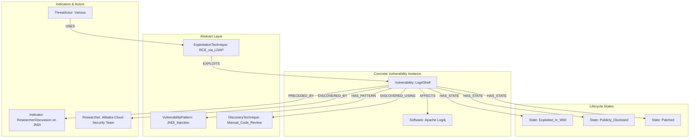

# A Graph-Based Model for the Zero-Day Vulnerability Lifecycle

## 1. Introduction

This document proposes a comprehensive, graph-based model for representing the entire lifecycle of zero-day vulnerabilities. The model is designed not merely to store facts about known zero-days but to enable reasoning about the *patterns* that lead to their discovery, exploitation, and eventual mitigation. This is a foundational component of a predictive security agent capable of identifying novel threats.

The proposed model is composed of several interconnected components:

*   **Vulnerability Lifecycle Model:** A temporal state machine that captures the evolution of a vulnerability over time.
*   **Abstract Vulnerability Patterns:** A way to model the root cause or class of a vulnerability, enabling reasoning across different software.
*   **Discovery & Exploitation Techniques:** A representation of the tradecraft used to find and exploit vulnerabilities.
*   **Precursors & Indicators:** A model for the subtle signals that can precede the discovery of a zero-day.

## 2. The Core Graph Schema

The model is designed as a property graph, with different node and edge types representing the various entities and relationships in the vulnerability ecosystem.

### 2.1. Core Node Types

*   **`Vulnerability`**: The central node, representing a specific flaw in a piece of software.
*   **`VulnerabilityState`**: Represents a specific state in the vulnerability's lifecycle (e.g., `Publicly_Disclosed`).
*   **`VulnerabilityPattern`**: An abstract node representing the class of vulnerability (e.g., `Use-After-Free`).
*   **`DiscoveryTechnique`**: The method used to find the vulnerability (e.g., `Fuzzing`).
*   **`ExploitationTechnique`**: The method used to exploit the vulnerability.
*   **`Indicator`**: A precursor or signal that hinted at the vulnerability's existence.
*   **`Software`**: The affected software product.
*   **`ThreatActor` / `Researcher`**: The entities that discover or exploit vulnerabilities.

### 2.2. The Vulnerability Lifecycle Model

The lifecycle is modeled as a non-linear, temporal state machine. A `Vulnerability` is linked to one or more `VulnerabilityState` nodes, each with a start and end time. This allows for parallel states (e.g., a vulnerability can be `Patched` by the vendor but still `Exploited_In_Wild` against unpatched systems).

The primary states are:

*   `Undiscovered`
*   `Privately_Disclosed`
*   `Exploited_In_Wild`
*   `Publicly_Disclosed` (with CVE)
*   `Patched`
*   `Weaponized`

### 3. Visualizing the Model

The following Mermaid diagram illustrates the interconnected nature of the proposed model, using the Log4Shell vulnerability as an example.

## 4. Conclusion

This graph-based model provides a rich, multi-faceted representation of the zero-day vulnerability ecosystem. By capturing not just the "what" but also the "why," "how," and "when" of vulnerabilities, it creates a powerful foundation for a predictive security agent. The ability to reason across abstract patterns and concrete instances is the key to identifying novel threats before they are widely exploited.