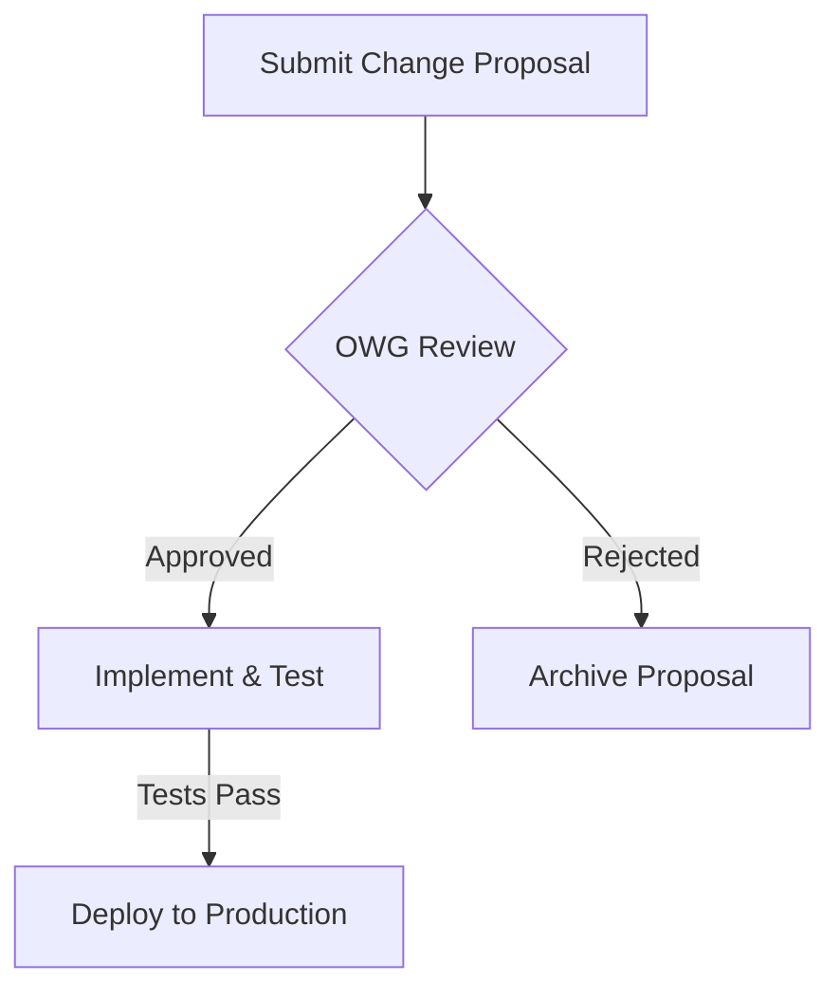

# Governance & Operationalization Specification

## 1. Introduction

This document defines the governance and operational frameworks for the knowledge base. It provides the non-technical and process-oriented structures required to ensure the long-term success, quality, and integrity of the system.

The specification is divided into four key areas:
1.  **Ontology Governance Charter:** The formal charter for the Ontology Working Group (OWG).
2.  **Data Federation Framework:** A quantitative decision framework for data ingestion strategies.
3.  **Data Quality Monitoring:** A comprehensive strategy for automated data quality monitoring.
4.  **Source Reliability Tracking:** A system for tracking the trustworthiness of intelligence sources.

---

## 2. Ontology Governance Charter

### 2.1. Mission and Responsibilities

The **Ontology Working Group (OWG)** is the governing body responsible for the strategic management and evolution of the knowledge base's ontologies.

**Mission:** To ensure the semantic integrity, consistency, and extensibility of the knowledge graph by managing the Upper Ontology and overseeing the development and integration of Domain Ontologies.

**Core Responsibilities:**

*   **Upper Ontology Management:** The OWG is the sole authority for approving any extensions or modifications to the adopted **Unified Cyber Ontology (UCO)**. This ensures the core semantic model remains stable and interoperable.
*   **Domain Ontology Approval:** The OWG is responsible for reviewing and approving all new Domain Ontologies proposed for integration into the knowledge graph.
*   **Change Management:** The OWG will oversee the formal process for proposing, reviewing, and ratifying all changes to the ontologies.
*   **Best Practices:** The OWG will establish and maintain best practices for ontology development, documentation, and alignment.

### 2.2. Roles and Responsibilities

The OWG will be composed of the following roles:

| Role | Responsibilities |
| :--- | :--- |
| **Ontology Steward (Chair)** | - Chairs OWG meetings.<br>- Manages the change proposal backlog.<br>- Acts as the primary point of contact for the OWG.<br>- Is the final arbiter on change approvals. |
| **Domain Expert (Member)** | - Represents a specific area of cybersecurity expertise (e.g., malware analysis, threat intelligence).<br>- Proposes and develops new Domain Ontologies.<br>- Reviews change proposals for their impact on their domain. |
| **Knowledge Engineer (Member)**| - Provides expertise on the technical implementation of the knowledge graph.<br>- Analyzes the technical feasibility and impact of proposed changes.<br>- Implements and tests approved ontology changes. |

### 2.3. Change Management Process

All changes to the ontology will follow a formal, transparent process.



**Steps:**

1.  **Submission:** Any stakeholder can submit a change proposal via a standardized template. The proposal must include a clear description of the change, the justification, and the expected impact.
2.  **Review:** The OWG will review all proposals during its monthly meeting. The review will assess the proposal's alignment with the mission, its technical feasibility, and its impact on existing data and analytics.
3.  **Decision:** The OWG will vote to either `Approve` or `Reject` the proposal. A majority vote is required for approval.
4.  **Implementation:** Approved changes are assigned to a Knowledge Engineer for implementation and testing in a staging environment.
5.  **Deployment:** Once testing is complete, the change is deployed to the production environment.
---

## 3. Data Federation Framework

### 3.1. Objective

To provide a quantitative decision framework for determining whether a new data source should be **materialized** (fully ingested and stored in the knowledge graph) or **virtualized** (queried on-demand from the source).

### 3.2. The Scorecard

The decision will be guided by a scorecard that weighs the technical and operational characteristics of the data source. Each factor is scored on a scale of 1 to 5, where 5 indicates a strong preference for materialization.

| Factor | Weight | Score (1-5) | Weighted Score | Description |
| :--- | :--- | :--- | :--- | :--- |
| **Query Frequency** | 30% | | | How often will this data be accessed? (1=Rarely, 5=Constantly) |
| **Data Volatility** | 20% | | | How often does the data change at the source? (1=Static, 5=Highly Volatile) |
| **Source API Reliability**| 20% | | | How reliable and performant is the source's API? (1=Unreliable/Slow, 5=Highly Reliable/Fast) |
| **Data Velocity** | 15% | | | How frequently is new data generated at the source? (1=Infrequently, 5=Streaming) |
| **Transformation Complexity**| 15% | | | How much transformation is required to map the data to our ontology? (1=Complex, 5=Simple/Direct) |
| **Total** | 100% | | | |

### 3.3. Decision Thresholds

The total weighted score will determine the integration strategy:

*   **Score > 4.0: Strong Candidate for Materialization.** The data is frequently accessed, relatively stable, and the source API is reliable. The benefits of local query performance outweigh the costs of storage and synchronization.
*   **Score 2.5 - 4.0: Hybrid Approach.** Consider materializing a "hot" subset of the data while leaving the rest to be virtualized. For example, materialize the last 30 days of data and virtualize access to historical data.
*   **Score < 2.5: Strong Candidate for Virtualization.** The data is infrequently accessed, highly volatile, or the source API is unreliable. The cost and complexity of materialization are not justified.

### 3.4. Process

1.  **Proposal:** A Domain Expert or Knowledge Engineer proposes a new data source for integration.
2.  **Scoring:** The proposer completes the scorecard and calculates the total weighted score.
3.  **Review:** The OWG reviews the scorecard and the proposed integration strategy during its monthly meeting.
4.  **Decision:** The OWG makes the final decision on the integration strategy.
---

## 4. Data Quality Monitoring

### 4.1. Objective

To define a comprehensive, automated strategy for monitoring the quality of the knowledge graph data. This system will provide real-time insights into the health of the graph and trigger alerts on anomalies.

### 4.2. Data Quality Metrics

The following metrics will be tracked to provide a holistic view of data quality:

| Metric | Description | Target |
| :--- | :--- | :--- |
| **Schema Conformance Rate** | The percentage of nodes and relationships that conform to the defined UCO schema. | > 99.9% |
| **Entity Resolution Accuracy** | The percentage of entities that are correctly resolved to a single, canonical node. Measured by the ratio of `confirmed` to `refuted` potential duplicates in the HITL system. | > 98% |
| **Relationship Completeness** | The percentage of nodes that have the expected set of core relationships. For example, the percentage of `Vulnerability` nodes that are linked to a `VulnerabilityPattern`. | > 95% |
| **Attribution Coverage** | The percentage of nodes and relationships that have a corresponding `Attribution` node, ensuring all data is traceable to a source. | 100% |
| **HITL Validation Rate** | The percentage of AI-generated assertions that have been validated by a human analyst. | > 90% |
| **Data Staleness** | The average time between a change occurring at the source and it being reflected in the graph. | < 24 hours |

### 4.3. Monitoring Architecture

The data quality monitoring system will be built on an event-driven architecture.

```mermaid
graph TD
    A[Ingestion Pipeline] -- "writes to" --&gt; B[(Graph DB)];
    B -- "triggers" --&gt; C{Change Data Capture};
    C -- "streams changes to" --&gt; D[Kafka Topic: graph-changes];
    D --&gt; E[Data Quality Service];
    E -- "calculates metrics" --&gt; F[(Time-Series DB <br> e.g., Prometheus)];
    F -- "provides data to" --&gt; G[Grafana Dashboard];
    E -- "sends alerts to" --&gt; H[Alerting Service <br> e.g., PagerDuty];
```

**Components:**

1.  **Change Data Capture (CDC):** A process that captures all changes (creations, updates, deletions) to the graph database in real-time.
2.  **Kafka Topic:** A dedicated topic (`graph-changes`) for streaming the change events.
3.  **Data Quality Service:** A microservice that consumes the change events, calculates the data quality metrics in real-time, and stores them in a time-series database.
4.  **Time-Series Database:** A database optimized for storing and querying time-series data (e.g., Prometheus, InfluxDB).
5.  **Grafana Dashboard:** A dashboard for visualizing the data quality metrics over time, providing insights into trends and anomalies.
6.  **Alerting Service:** A service that triggers alerts (e.g., via PagerDuty, Slack) when a data quality metric breaches a predefined threshold.
---

## 5. Source Reliability Tracking

### 5.1. Objective

To propose a system for tracking the reliability and trustworthiness of different intelligence sources over time. This system will use the data from the HITL validation process to create a quantitative score that can be used to weight assertions.

### 5.2. Reliability Score Calculation

Each `Source` (modeled as a `uco-identity:Identity` node) will have a `reliabilityScore` property. This score will be a value between 0 and 1, calculated based on the historical accuracy of the assertions attributed to the source.

The score will be calculated using a time-decaying formula to give more weight to recent validations.

**Formula:**

```
ReliabilityScore = (Sum of (ValidationValue * DecayFactor)) / (Sum of DecayFactor)
```

Where:

*   **ValidationValue:** `1` for a `human-validated` assertion, `0` for a `human-rejected` assertion.
*   **DecayFactor:** `exp(-lambda * days_since_validation)`, where `lambda` is a decay constant (e.g., `0.01`) that controls how quickly older validations lose influence.

### 5.3. Architecture

A scheduled nightly job will be responsible for recalculating the reliability scores for all sources.

```mermaid
graph TD
    A[Scheduled Job] -- "1. Query for all sources" --&gt; B[(Graph DB)];
    B -- "2. Return sources" --&gt; A;
    A -- "3. For each source, query for recent HITL validations" --&gt; B;
    B -- "4. Return validation data" --&gt; A;
    A -- "5. Calculate new reliability score" --&gt; C{Score Calculation};
    C -- "6. Update reliabilityScore property on source node" --&gt; B;
```

### 5.4. Application of the Score

The `reliabilityScore` will be used to provide a more nuanced view of confidence in the knowledge graph. When a user queries the graph, the confidence of an assertion can be presented as a combination of the AI's initial confidence and the reliability of the source.

**Example Cypher Query (Retrieving a weighted confidence score):**

```cypher
MATCH (ta:Identity {name: "ThreatActor-1"})-[:hasAttribution]-&gt;(attr)-[:source]-&gt;(source)
RETURN
    ta.name AS entity,
    attr.statement AS statement,
    attr.confidence AS aiConfidence,
    source.name AS source,
    source.reliabilityScore AS sourceReliability,
    (attr.confidence * 0.7) + (source.reliabilityScore * 0.3) AS weightedConfidence
ORDER BY weightedConfidence DESC
```