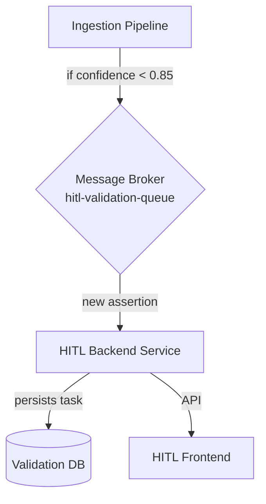
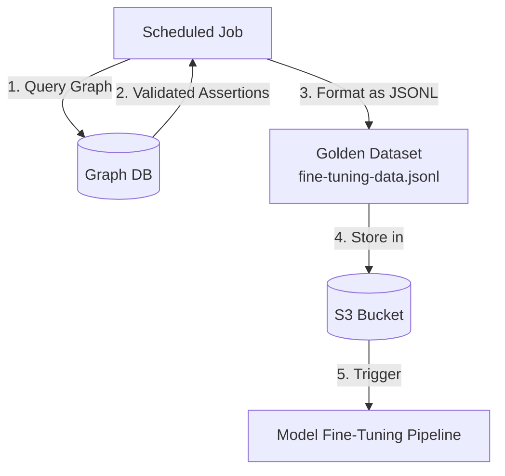

# Human-in-the-Loop (HITL) System Design Specification

## 1. Introduction

This document provides the detailed design specification for the Human-in-the-Loop (HITL) system. This system is a critical component of the knowledge graph ingestion pipeline, responsible for ensuring the accuracy and quality of AI-generated data through human validation.

This design addresses the four key objectives outlined in the research plan:
1.  Analyst Validation Workflow & UI
2.  Confidence-Based Prioritization
3.  The Feedback Loop Architecture
4.  Gamification & Metrics

## 2. Analyst Validation Workflow & UI

The HITL interface is designed for efficiency and accuracy, allowing analysts to quickly review, correct, and validate assertions.

### 2.1. UI Design: Two-Panel Layout

The UI will be a two-panel single-page application (SPA):

*   **Left Panel (Validation Queue):** A scrollable list of assertions awaiting validation, sorted by the AI's confidence score in ascending order. Each item in the list will display a concise summary of the assertion, the confidence score, and the source document.
*   **Right Panel (Detail View):** A detailed view for the selected assertion, containing:
    *   **Source Viewer:** The original source text with the specific evidence snippet highlighted.
    *   **Assertion Editor:** A structured form to view and edit the assertion's subject, relationship, and object.
    *   **Action Buttons:** Buttons to `Accept`, `Reject`, `Save Edits`, and `Flag for Review`.

### 2.2. UI Mockup

```mermaid
graph TD
    subgraph HITL Validation Interface
        direction LR
        subgraph Queue Panel [Validation Queue]
            direction TB
            Q1[Assertion 1 <br> Confidence: 0.65]
            Q2[Assertion 2 <br> Confidence: 0.68]
            Q3[Assertion 3 <br> Confidence: 0.71]
            Q1 -- selects --> Editor
        end
        subgraph Detail Panel [Detail View]
            direction TB
            Editor{Assertion Editor}
            Viewer[Source Viewer]
            Buttons[Accept | Reject | Save | Flag]
            Editor -- displays --> Viewer
            Editor -- enables --> Buttons
        end
    end
```

### 2.3. Core UI Components & Functionality

*   **Entity Autocomplete:** The subject and object fields in the Assertion Editor will feature a fuzzy-search autocomplete that queries existing entities in the knowledge graph. It will also include a `[Create New Entity]` option.
*   **Relationship Dropdown:** The relationship field will be a searchable dropdown, populated with valid relationship types from the UCO ontology.
*   **Keyboard Shortcuts:** To maximize efficiency, the UI will support keyboard shortcuts (e.g., `J`/`K` for navigation, `A` for Accept, `R` for Reject, `E` for Edit).

## 3. Confidence-Based Prioritization

The system will automatically route low-confidence assertions to the HITL queue, optimizing analyst time.

### 3.1. Architecture: Message-Driven Queue

The prioritization system will be built on a message broker (e.g., RabbitMQ, Kafka).



### 3.2. Workflow

1.  The **Ingestion Pipeline** generates an assertion and a confidence score.
2.  If the confidence score is below a configurable threshold (e.g., `0.85`), it publishes the assertion to a dedicated topic on the **Message Broker**.
3.  The **HITL Backend Service** consumes messages from the queue, persists them in a database, and exposes them to the frontend via an API.

## 4. The Feedback Loop Architecture

The feedback loop is the most critical component, turning analyst corrections into a "golden dataset" for model fine-tuning.

### 4.1. Data Model for Validated Assertions

When an analyst validates an assertion, the corresponding `Attribution` node in the graph will be updated with a `validationStatus` property (`human-validated` or `human-rejected`).

### 4.2. Architecture: Scheduled Data Extraction

A scheduled job (e.g., a nightly cron job) will be responsible for creating the fine-tuning dataset.



### 4.3. Golden Dataset Format

The output will be a JSONL file, where each line is a structured object ready for fine-tuning:

```json
{
  "source_text": "The original evidence text...",
  "validated_assertion": {
    "subject": {"name": "Tool X", "type": "uco-tool:Tool"},
    "relationship": "uses",
    "object": {"name": "Technique Y", "type": "uco-vocabulary:Vulnerability"}
  },
  "status": "accepted"
}
```

## 5. Gamification & Metrics

To incentivize analysts and measure performance, a system of metrics and gamification will be implemented.

### 5.1. Key Metrics

*   **Analyst Metrics:**
    *   `Assertions Reviewed per Hour`
    *   `Correction Rate`
    *   `Accuracy Score` (derived from peer/senior review)
*   **System Metrics:**
    *   `Validation Queue Length`
    *   `Average Time to Validation`

### 5.2. Gamification Elements

*   **Leaderboard:** A dashboard ranking analysts on a score combining efficiency (`Assertions Reviewed per Hour`) and quality (`Accuracy Score`).
*   **Badges:** Digital badges awarded for achieving specific milestones (e.g., "1000 Assertions Reviewed," "99% Accuracy Club").