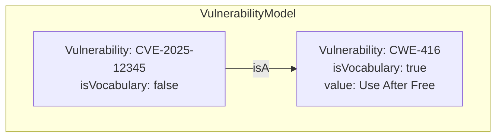
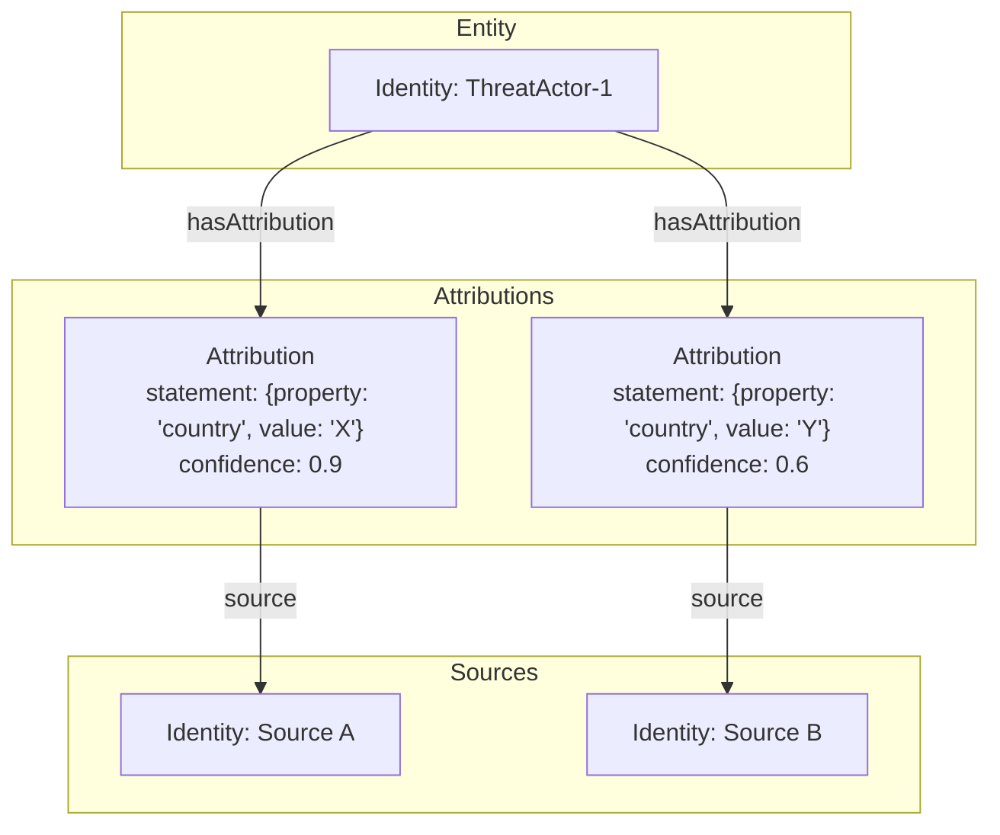
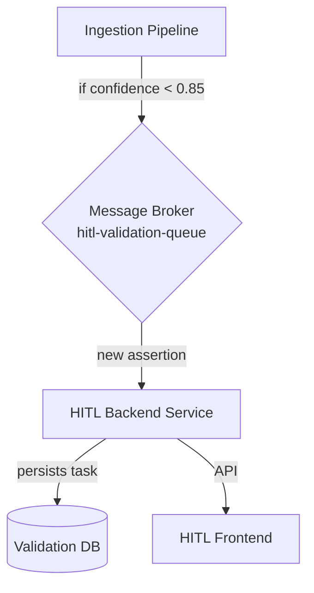
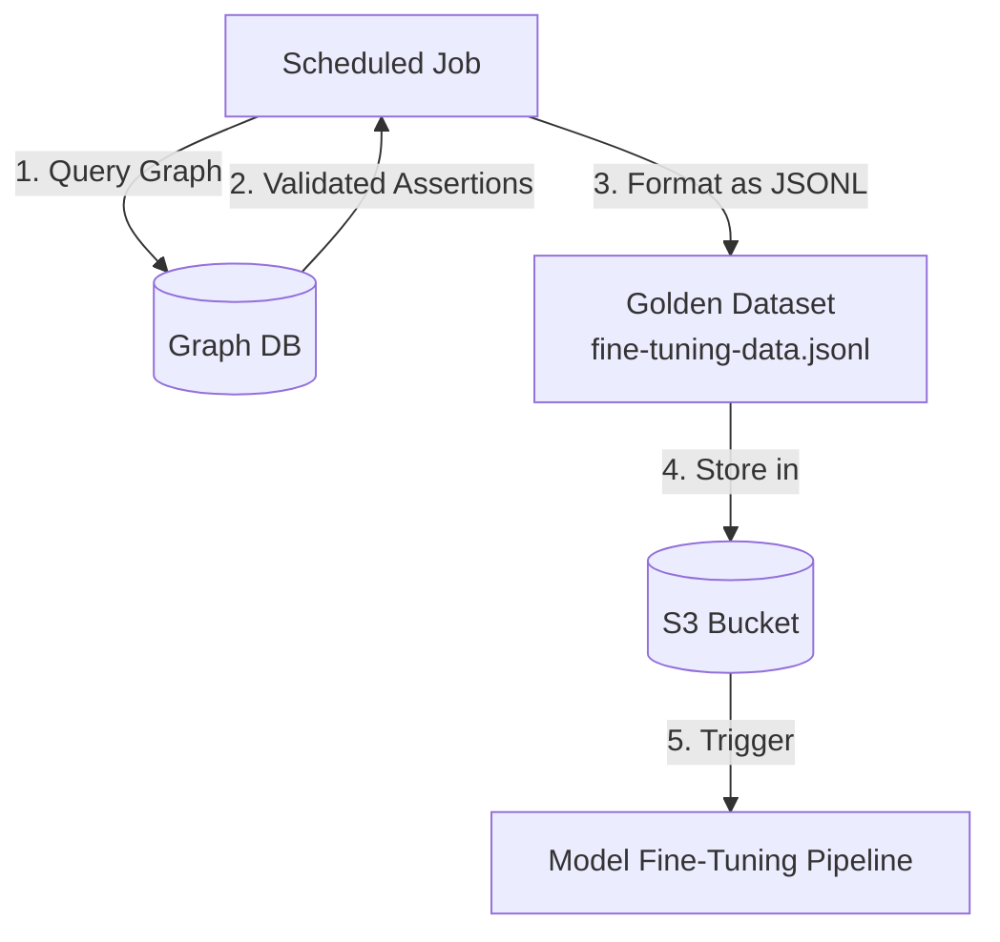

# Implementation-Ready Architecture for the Next-Generation Knowledge Base

## 1. Introduction

This document provides the complete, implementation-ready architecture for the next-generation knowledge base. It synthesizes the detailed research and design specifications from the deep-dive investigation phase into a single, coherent blueprint for development. The goal of this document is to serve as the master guide for building a robust, scalable, and high-quality knowledge graph.

---

## 2. Finalized Ontology & Schema

This section presents the definitive UCO-based schema, including the detailed attributes for key nodes like `VulnerabilityPattern` and the specific Cypher/pseudo-code for the temporal and evidence models.

### 2.1. Upper Ontology: Unified Cyber Ontology (UCO)

The knowledge graph will formally adopt the **Unified Cyber Ontology (UCO)** as its upper ontology. This provides significant advantages in interoperability, robustness, and alignment with our core event-centric and assertion-based design principles. Our initial concepts map to UCO as follows:

| Initial Concept | UCO Equivalent |
| :--- | :--- |
| `Entity` | `uco-core:UcoObject` |
| `Event` | `uco-action:Action` |
| `Source` | `uco-identity:Identity` |
| `Assertion` | `uco-core:Attribution` |
| `Concept` | `uco-vocabulary:Vocabulary` |

### 2.2. `VulnerabilityPattern` Node Definition

Abstract vulnerability patterns (e.g., CWEs) and specific vulnerabilities (e.g., CVEs) are both modeled as `uco-vocabulary:Vulnerability` nodes, distinguished by an `isVocabulary` property.

**Pattern Node (`isVocabulary: true`):**
*   **`@type`**: `uco-vocabulary:Vulnerability`
*   **`isVocabulary`**: `true`
*   **`vocabulary`**: "CWE"
*   **`key`**: "CWE-416"
*   **`value`**: "Use After Free"
*   **`description`**: "Referencing memory after it has been freed..."

**Instance Node (`isVocabulary: false`):**
A specific CVE is linked to its pattern via the `uco-vocabulary:isA` relationship.



### 2.3. Temporal Model: Event-Sourced State

The state of any entity is not stored as a property on the node itself but is **derived from the immutable sequence of events** related to it. This provides a fully auditable temporal model. The lifecycle of a vulnerability, for example, is modeled as a series of `Action` nodes (`Disclose`, `Exploit`, `Patch`) that target the central `Vulnerability` node.

**Example Cypher (Reconstructing State at a Point in Time):**
```cypher
// Parameter for the point in time of interest
WITH datetime("2025-02-15T00:00:00.000Z") AS pointInTime
MATCH (v:Vulnerability {key: "CVE-2025-9999"})
// Find all relevant lifecycle actions that occurred up to that point
OPTIONAL MATCH (action)-[]->(v)
WHERE action.actionType IN ["Disclose", "Patch", "Exploit"]
  AND COALESCE(action.endTime, action.startTime) <= pointInTime
// Order the actions chronologically to find the most recent one
WITH v, action ORDER BY COALESCE(action.endTime, action.startTime) DESC
WITH v, COLLECT(action)[0] AS lastAction
// Determine the state based on the last action
RETURN
    v.key AS vulnerability,
    CASE
        WHEN lastAction.actionType = "Patch" THEN "Patched"
        WHEN lastAction.actionType = "Exploit" THEN "Exploited in the Wild"
        WHEN lastAction.actionType = "Disclose" THEN "Disclosed"
        ELSE "Unknown"
    END AS stateAtPointInTime
```

### 2.4. Evidence Model: The "Attributed Statement" Pattern

To handle conflicting intelligence, each piece of sourced information is stored in a separate `Attribution` node. This keeps the primary entity node "clean" and makes all claims auditable.



---

## 3. The Ingestion Engine

The Ingestion Engine is responsible for processing raw data from various sources, extracting structured information, and populating the knowledge graph.

*(Note: The detailed specification for AI models, LLM prompts, and `tree-sitter` parsing logic is still under development. This section outlines the high-level architecture.)*

The pipeline will be designed to handle a variety of structured and unstructured data sources. The core components will include:
*   **Data Connectors:** Modules for fetching data from different sources (e.g., APIs, document stores, message queues).
*   **Parsing & Extraction Layer:** This layer will use a combination of traditional parsers and advanced AI models (LLMs) to extract entities and relationships from raw text and data.
*   **Entity Resolution:** A service to deduplicate and resolve extracted entities against the existing knowledge graph.
*   **Graph Mapping:** A component to map the extracted and resolved data to the UCO schema.
*   **Confidence Scoring:** An AI-driven component to assign a confidence score to each generated assertion before it is committed to the graph or routed to the HITL system.

---

## 4. The Quality Assurance Framework

The Quality Assurance Framework is centered around a robust Human-in-the-Loop (HITL) system that ensures the accuracy and quality of AI-generated data through human validation.

### 4.1. Confidence-Based Queuing

The system uses a message-driven architecture to optimize analyst time. Assertions generated by the Ingestion Engine with a confidence score below a configurable threshold (e.g., `0.85`) are automatically published to a message queue for human review.



### 4.2. Analyst Validation Workflow

The analyst workflow is facilitated by a two-panel UI designed for efficiency:
*   **Left Panel (Validation Queue):** A prioritized list of assertions awaiting review.
*   **Right Panel (Detail View):** A detailed view for editing the selected assertion, viewing the highlighted source text, and taking action (`Accept`, `Reject`, `Save Edits`).

### 4.3. The Feedback Loop for Model Fine-Tuning

The HITL system's primary strategic value is its feedback loop. Analyst corrections are used to create a "golden dataset" for fine-tuning the AI models.
1.  A scheduled job queries the graph for human-validated assertions.
2.  It formats this data into a JSONL file.
3.  The file is stored in an S3 bucket, which triggers the model fine-tuning pipeline.



---

## 5. Governance & Operational Framework

This section outlines the process-oriented structures required to ensure the long-term success, quality, and integrity of the knowledge base.

### 5.1. Ontology Governance

An **Ontology Working Group (OWG)** will be the governing body responsible for the strategic evolution of the knowledge base's ontologies.
*   **Mission:** To ensure the semantic integrity, consistency, and extensibility of the graph.
*   **Responsibilities:** The OWG is the sole authority for approving modifications to the UCO Upper Ontology and for ratifying new Domain Ontologies.
*   **Process:** All changes will follow a formal, transparent process: Submission -> OWG Review -> Implement & Test -> Deploy.

### 5.2. Data Federation Framework

A quantitative scorecard will guide the decision of whether to **materialize** (ingest) or **virtualize** (query on-demand) a new data source. The decision is based on a weighted score of factors like Query Frequency, Data Volatility, and API Reliability.
*   **Score > 4.0:** Strong candidate for Materialization.
*   **Score 2.5 - 4.0:** Hybrid approach.
*   **Score < 2.5:** Strong candidate for Virtualization.

### 5.3. Data Quality Monitoring

An event-driven architecture will provide real-time insights into the health of the graph.
1.  **Change Data Capture (CDC)** streams all graph database changes to a Kafka topic.
2.  A **Data Quality Service** consumes these events, calculates metrics (e.g., Schema Conformance, Entity Resolution Accuracy), and stores them in a time-series database.
3.  A **Grafana Dashboard** visualizes the metrics, and an alerting service triggers notifications on anomalies.

```mermaid
graph TD
    A[Ingestion Pipeline] -- "writes to" --&gt; B[(Graph DB)];
    B -- "triggers" --&gt; C{Change Data Capture};
    C -- "streams changes to" --&gt; D[Kafka Topic: graph-changes];
    D --&gt; E[Data Quality Service];
    E -- "calculates metrics" --&gt; F[(Time-Series DB)];
    F -- "provides data to" --&gt; G[Grafana Dashboard];
    E -- "sends alerts to" --&gt; H[Alerting Service];
```

### 5.4. Source Reliability Tracking

The reliability of intelligence sources will be tracked quantitatively. Each `Source` node will have a `reliabilityScore` property calculated from the historical accuracy of its assertions as validated by the HITL system. The score uses a time-decaying formula to give more weight to recent validations, providing a nuanced, weighted confidence score for all data in the graph.

---

## 6. Implementation Roadmap

This section proposes a high-level, phased implementation plan based on the detailed specifications.

### Phase 1: Core Infrastructure & Schema (Months 1-2)
*   **Goal:** Establish the foundational infrastructure and implement the core ontology.
*   **Key Activities:**
    *   Deploy the graph database (e.g., Neo4j).
    *   Implement the UCO Upper Ontology and the core `VulnerabilityPattern` schema.
    *   Set up the initial data quality monitoring service (schema conformance).
    *   Develop the initial data connectors for 1-2 high-priority, structured data sources.

### Phase 2: Ingestion Pipeline & HITL MVP (Months 3-4)
*   **Goal:** Build the initial ingestion pipeline and a minimum viable product (MVP) for the HITL system.
*   **Key Activities:**
    *   Develop the message-driven queuing system for HITL.
    *   Build the HITL backend service and the core UI for validation.
    *   Implement the first version of the AI-powered extraction and confidence scoring models.
    *   Begin ingesting and validating data from the initial sources.

### Phase 3: Feedback Loop & Governance Launch (Months 5-6)
*   **Goal:** Close the feedback loop for model fine-tuning and formally launch the governance framework.
*   **Key Activities:**
    *   Implement the scheduled job for creating the "golden dataset" from HITL validations.
    *   Build and test the initial model fine-tuning pipeline.
    *   Formally constitute the Ontology Working Group (OWG) and begin regular meetings.
    *   Implement the Data Federation Scorecard process for evaluating new data sources.

### Phase 4: Expansion & Optimization (Months 7+)
*   **Goal:** Expand data source coverage, enhance the models, and optimize the system.
*   **Key Activities:**
    *   Onboard new data sources based on the federation framework.
    *   Continuously fine-tune and improve the AI extraction models.
    *   Implement the full suite of data quality monitoring and source reliability tracking.
    *   Develop and launch the gamification features for the HITL system.