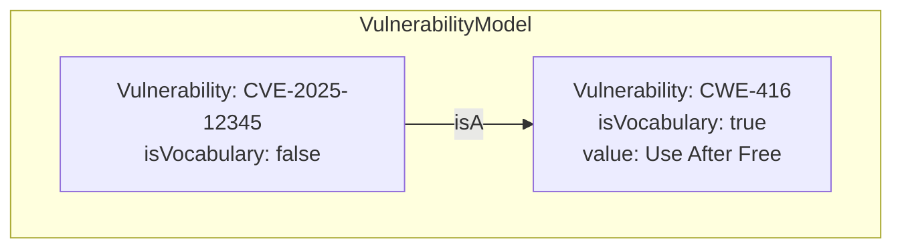
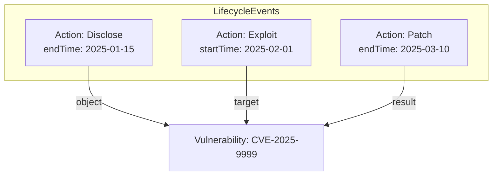
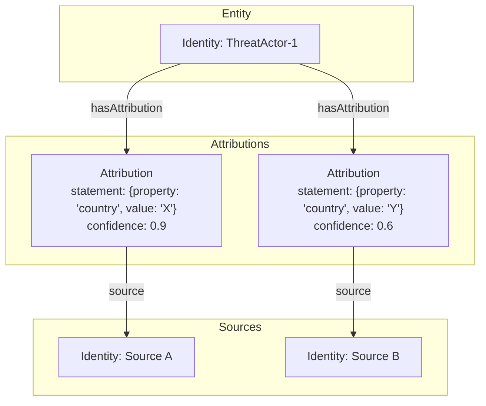

# Schema & Ontology Implementation Details

## 1. Introduction

This document provides the definitive technical specification for the implementation of the knowledge graph's schema and ontology. It addresses the outstanding research questions from the `RESEARCH_PLAN.md` and provides concrete models and examples to guide development.

This specification is the result of a deep-dive investigation, including the evaluation of existing research and new analysis conducted using advanced AI research tools.

---

## 2. Finalized Upper Ontology: Unified Cyber Ontology (UCO)

### 2.1. Decision: Adoption of UCO

After a thorough review, we have made the decision to formally adopt the **Unified Cyber Ontology (UCO)** as the Upper Ontology for our knowledge graph.

### 2.2. Justification

The initial `UNIFIED_GRAPH_SCHEMA.md` proposed a custom, simplified upper ontology that was conceptually sound. However, adopting a standardized, community-driven ontology like UCO provides several critical advantages:

1.  **Interoperability:** UCO is designed as a "hub" to integrate with other standards (like STIX), which will significantly reduce the effort required to ingest data from diverse external sources in the future.
2.  **Robustness & Extensibility:** UCO provides a rich, well-defined set of classes and relationships for cybersecurity concepts, reducing the need for us to "reinvent the wheel." It is also designed to be formally extended without breaking the core.
3.  **Alignment with Core Principles:** UCO's design philosophy aligns perfectly with our established principles:
    *   It is **event-centric**, using `uco-action:Action` nodes to model events.
    *   It is **assertion-based**, using `uco-core:Attribution` to handle evidence, confidence, and provenance in a structured way.

### 2.3. Mapping to UCO

Our initial conceptual schema maps cleanly to UCO's structure. The following table defines the official mapping:

| Initial Concept | UCO Equivalent | Implementation Notes |
| :--- | :--- | :--- |
| `Entity` | `uco-core:UcoObject` | Concrete instances will use specific subclasses (e.g., `uco-identity:Identity`, `uco-tool:Tool`, `uco-observable:File`). |
| `Event` | `uco-action:Action` | A direct mapping. Relationships like `PERFORMED` and `USED_TOOL` map to UCO roles like `performer` and `instrument`. |
| `Source` | `uco-identity:Identity` | The origin of data (e.g., "VirusTotal", "Analyst Notes") is modeled as an `Identity` object. |
| `Assertion` | `uco-core:Attribution` | Our `Assertion` concept is implemented via the `Attribution` object, which links an `Action` or `UcoObject` to its `Source` and holds metadata like `confidence`. |
| `Concept` | `uco-vocabulary:Vocabulary` | Abstract concepts (e.g., "Payload", "Use-After-Free") are not modeled as nodes but as properties on concrete objects, typically referencing a controlled vocabulary. |

---

## 3. `VulnerabilityPattern` Node Definition

To enable generalization about threats, we must model abstract vulnerability patterns (e.g., CWEs) distinctly from specific vulnerabilities (e.g., CVEs).

Both will be represented by `uco-vocabulary:Vulnerability` nodes, but distinguished by a property and linked by a relationship.

### 3.1. Attributes for a Vulnerability Pattern

A `Vulnerability` node representing an abstract pattern will have the following properties:

| Property | Data Type | Example Value | Description |
| :--- | :--- | :--- | :--- |
| `@type` | String | `uco-vocabulary:Vulnerability` | The UCO class for the node. |
| `isVocabulary` | Boolean | `true` | **Crucial discriminator:** Flags this node as a definition/pattern, not an observed instance. |
| `vocabulary` | String | `"CWE"` | The controlled vocabulary the pattern belongs to (e.g., Common Weakness Enumeration). |
| `key` | String | `"CWE-416"` | The unique identifier for the pattern within its vocabulary. |
| `value` | String | `"Use After Free"` | The human-readable name of the pattern. |
| `description` | String | `"Referencing memory after it has been freed..."` | The canonical description of the weakness. |

### 3.2. Linking Instances to Patterns

A specific vulnerability instance (e.g., a CVE) will be a separate `Vulnerability` node with `isVocabulary: false`. It will be linked to its abstract pattern using the `uco-vocabulary:isA` relationship.



---

## 4. Temporal & Evidence Model Implementation

### 4.1. Temporal Model: Vulnerability Lifecycle

The state of an entity is not stored as a property on the node itself but is **derived from the immutable sequence of events** related to it. This provides a fully auditable temporal model.

**Example Model:** The lifecycle of a vulnerability is modeled as a series of `Action` nodes (`Disclose`, `Exploit`, `Patch`) that target the central `Vulnerability` node.



**Example Cypher Query (Reconstructing State):**

This query determines the state of a vulnerability at a specific point in time by finding the most recent relevant action.

```cypher
// Parameter for the point in time of interest
WITH datetime("2025-02-15T00:00:00.000Z") AS pointInTime

MATCH (v:Vulnerability {key: "CVE-2025-9999"})

// Find all relevant lifecycle actions that occurred up to that point
OPTIONAL MATCH (action)-[]->(v)
WHERE action.actionType IN ["Disclose", "Patch", "Exploit"]
  AND COALESCE(action.endTime, action.startTime) <= pointInTime

// Order the actions chronologically to find the most recent one
WITH v, action ORDER BY COALESCE(action.endTime, action.startTime) DESC
WITH v, COLLECT(action)[0] AS lastAction

// Determine the state based on the last action
RETURN
    v.key AS vulnerability,
    CASE
        WHEN lastAction.actionType = "Patch" THEN "Patched"
        WHEN lastAction.actionType = "Exploit" THEN "Exploited in the Wild"
        WHEN lastAction.actionType = "Disclose" THEN "Disclosed"
        ELSE "Unknown"
    END AS stateAtPointInTime
```

### 4.2. Evidence Model: The "Attributed Statement" Pattern

To handle conflicting intelligence about a single attribute, we use the **"Attributed Statement"** pattern. This avoids polluting a primary node with uncertain data and makes all claims auditable.

The core entity node remains "clean." Each piece of sourced information about it is stored in a separate `Attribution` node, which contains the claim as a property map.

**Example Model:** `Source A` claims `ThreatActor-1` is from country `X`, while `Source B` claims they are from country `Y`.



**Example Cypher Query (Creating Conflicting Claims):**

```cypher
// The core entity, with no direct country property
MERGE (ta:Identity {name: "ThreatActor-1"})

// The sources
MERGE (sourceA:Identity {name: "Source A"})
MERGE (sourceB:Identity {name: "Source B"})

// Create the first attributed statement
MERGE (attrA:Attribution {
    statement: {property: "countryOfOrigin", value: "X"},
    confidence: 0.9
})
MERGE (ta)-[:hasAttribution]->(attrA)
MERGE (attrA)-[:source]->(sourceA)

// Create the second, conflicting attributed statement
MERGE (attrB:Attribution {
    statement: {property: "countryOfOrigin", value: "Y"},
    confidence: 0.6
})
MERGE (ta)-[:hasAttribution]->(attrB)
MERGE (attrB)-[:source]->(sourceB)