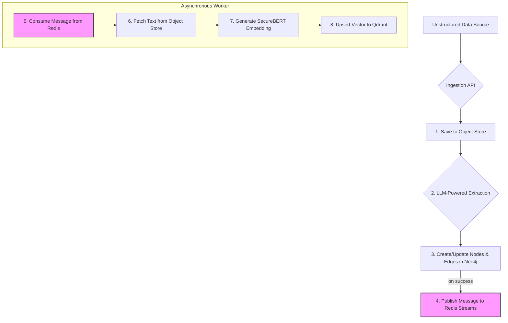

# AlgoBrain Phase 1 Verification & Recommendations

## 1. Executive Summary

This document summarizes the findings from a deep analysis of the AlgoBrain Phase 1 plans, with a specific focus on the data management strategy for the RAG and GraphRAG systems. The original architecture is well-researched and provides a strong foundation. However, to achieve a higher degree of perfection and address potential long-term challenges, the following key recommendations are proposed.

The core of these recommendations is to evolve the data ingestion pipeline into a more resilient, decoupled, and intelligent system that ensures data consistency and enhances the system's ability to learn from new, unstructured information.

**Key Recommendations:**

1.  **Adopt a "Graph-First" Ingestion Architecture:** Make Neo4j the single source of truth for all entities to eliminate data drift between the graph and vector databases.
2.  **Introduce an Object Store:** Store raw text blobs in a dedicated object store (e.g., MinIO or S3) and link to them from Neo4j, keeping the graph database lean and performant.
3.  **Implement a Decoupled Vectorization Pipeline:** Use a message queue (MQ) to asynchronously trigger the vectorization and ingestion of content into Qdrant after it has been successfully committed to the graph.
4.  **Leverage LLM-Powered Entity Extraction:** Enhance the ingestion pipeline with an LLM to dynamically extract new entities and relationships from unstructured data, allowing the knowledge graph to evolve.
5.  **Upgrade to an LLM-Based Query Router:** Replace the current keyword-based routing logic with a more sophisticated LLM-based router that can understand user intent for more accurate agent selection.

## 2. Proposed "Graph-First" Ingestion Architecture

The current model risks data inconsistency between Neo4j and Qdrant. The proposed architecture solves this by creating a single, resilient ingestion flow.

**Benefits of this Architecture:**

*   **Data Consistency:** Neo4j serves as the single source of truth, eliminating data drift.
*   **Resilience:** The message queue ensures that vectorization can be retried if a downstream service (like the embedding model or Qdrant) is temporarily unavailable.
*   **Performance:** The ingestion API can respond quickly after the fast Neo4j transaction, while the slower vectorization process happens asynchronously.
*   **Scalability:** The vectorization workers can be scaled independently to handle high-volume ingestion.
*   **Lean Graph:** Storing only a URI in Neo4j keeps the graph database optimized for what it does best: high-speed traversals.

## 3. Actionable Changes for Phase 1

To implement this improved architecture, the following changes should be made to the project documents.

### 3.1. Updates to `ROADMAP.md`

**Phase 1 Tasks (Section 7):**

The "Infrastructure Setup" and "Core Agent Framework" tasks should be updated to include the new components.

*   **Infrastructure Setup:**
    *   Add "Deploy Redis for caching and message queueing."
    *   Add "Deploy an object store (e.g., MinIO) for raw text storage."
*   **Core Agent Framework:**
    *   Modify "Implement supervisor agent with basic routing" to "**Implement supervisor agent with LLM-based routing**."
    *   Add a new task: "**Develop a unified ingestion service with LLM-powered entity extraction.**"
    *   Add a new task: "**Implement an asynchronous vectorization worker that consumes from Redis Streams.**"

### 3.2. Updates to `TECHNICAL_SPECIFICATIONS.md`

**Database Schemas (Section 2.2):**

*   **Neo4j Graph Schema:** The properties for nodes that contain large amounts of text (e.g., `:Technique`, `:Tool`, `:Intelligence`) should be modified. The `description` or `content` property should be replaced with a `content_uri` property that stores the path to the full text in the object store.
*   **Qdrant Collections Schema:** The payload for each collection should include a `neo4j_node_id` field to maintain a direct link back to the source of truth in the graph.

**API Specifications (Section 3):**

*   A new internal API endpoint should be specified for the ingestion service: `POST /api/v1/internal/ingest`.

**Deployment Specifications (Section 7):**

*   The `docker-compose.yml` and Kubernetes configurations should be updated to include `redis` and an object store service like `minio`.

## 4. Conclusion

By incorporating these changes into the Phase 1 plan, the AlgoBrain project will be built on a more robust, scalable, and intelligent data foundation. This addresses the primary concerns around data management effectiveness and sets the project up for long-term success and evolution.