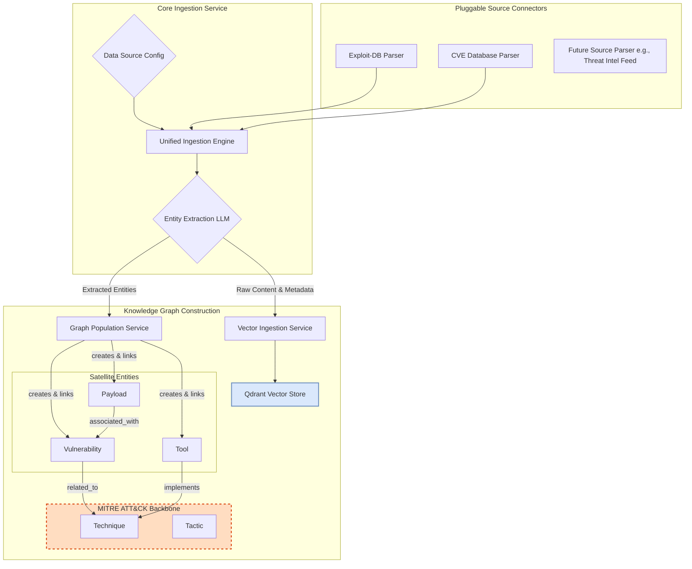

# AlgoBrain Data Ingestion Architecture

## 1. Core Principle: The MITRE ATT&CK Backbone ("Spina Dorsale")

The entire AlgoBrain knowledge graph is built upon a single, foundational principle: **MITRE ATT&CK is the central backbone (the "spina dorsale") that provides structure and context to all other security data.**

Every piece of information ingested into the system, regardless of its source or type, must be connected to this core framework. This design ensures that we are not merely creating a repository of disconnected facts, but a cohesive, interconnected knowledge graph where every tool, vulnerability, and payload exists within the context of established attacker tactics and techniques. This approach transforms raw data into strategic intelligence.

---

## 2. Extensible Ingestion Architecture

To support the ongoing integration of new and diverse data sources, the ingestion pipeline is designed to be modular, extensible, and configuration-driven. This architecture separates the core ingestion logic from the source-specific parsing, allowing for rapid development and integration of new knowledge sources without re-engineering the central pipeline.

---

## 3. Component Breakdown

*   **Source Connectors (Parsers):** These are source-specific modules responsible for fetching and normalizing data from a particular source (e.g., an API, a git repository, a database). Each parser implements a standardized interface, ensuring compatibility with the core engine.
*   **Unified Ingestion Engine:** The central orchestrator of the pipeline. It is driven by a configuration file that defines the available sources and their corresponding parsers.
*   **Entity Extraction LLM:** A Large Language Model (Gemini 2.5 Flash) fine-tuned with specific prompts to analyze the normalized text from a parser and extract key security entities (CVEs, tool names, MITRE IDs, etc.) and their relationships.
*   **Graph Population Service:** This service takes the structured entities from the LLM and performs the critical task of creating or updating nodes in the Neo4j graph. Its primary responsibility is to enforce the "spina dorsale" principle by ensuring every new entity is linked back to the MITRE ATT&CK backbone.
*   **Vector Ingestion Service:** This service handles the vectorization of the raw text. It embeds the content using SecureBERT and upserts it into the appropriate Qdrant collection, along with metadata linking it back to its corresponding node in the Neo4j graph.

---

## 4. Data Flow Walkthrough (Example: Ingesting an Exploit-DB Entry)

1.  **Initiation:** The `Unified Ingestion Engine` is triggered, loading its configuration which points to the `Exploit-DB Parser`.
2.  **Parsing:** The `Exploit-DB Parser` fetches a new entry. It normalizes the content into a standardized format, separating the raw text from any available structured metadata.
3.  **Entity Extraction:** The normalized text is passed to the `Entity Extraction LLM`. The LLM identifies a CVE (`CVE-2024-12345`), a target application, and determines that the exploit relates to the MITRE technique `T1190: Exploit Public-Facing Application`.
4.  **Graph Population:** The `Graph Population Service` receives these entities.
    *   It creates a new `(:Vulnerability {cve_id: 'CVE-2024-12345'})` node.
    *   It then creates a relationship: `(v:Vulnerability {cve_id: 'CVE-2024-12345'})-[:EXPLOITS]->(t:Technique {mitre_id: 'T1190'})`. This crucial step connects the new information to the MITRE backbone.
5.  **Vector Ingestion:** The `Vector Ingestion Service` takes the full, raw text of the Exploit-DB entry, generates a SecureBERT embedding, and upserts it into the `exploits` collection in Qdrant. The vector's metadata includes `{ "cve_id": "CVE-2024-12345" }`, creating a link back to the graph.

---

## 5. Developer's Guide: Adding a New Data Source

Integrating a new data source is a straightforward process designed to be completed with minimal effort:

1.  **Create a New Parser:**
    *   Develop a new Python class that inherits from a standardized `BaseSourceParser` abstract class.
    *   Implement the required methods: `fetch()` to retrieve the data and `normalize()` to transform it into a simple, standardized dictionary format.
2.  **Update the Configuration:**
    *   Add a new entry to the data sources configuration file (e.g., `sources.yaml`), defining the name of the new source and the path to its parser class.
3.  **Define Entity Mappings (Optional):**
    *   If the new source introduces new entity types, update the Neo4j schema and the `Graph Population Service` to handle them. Ensure that a clear relationship path to the MITRE backbone is defined.
4.  **Run the Ingestion Pipeline:**
    *   The `Unified Ingestion Engine` will automatically discover and utilize the new parser, integrating the new data source into the knowledge graph.